## 音乐

```
如果你要离去，就请记住我依然爱你；如果你要回来，我会在这儿等你...

如果你正享受幸福，请你忘记我；

如果梦的那头有美丽的期待，化作孤独情鸟飞过那蔚蓝。

```

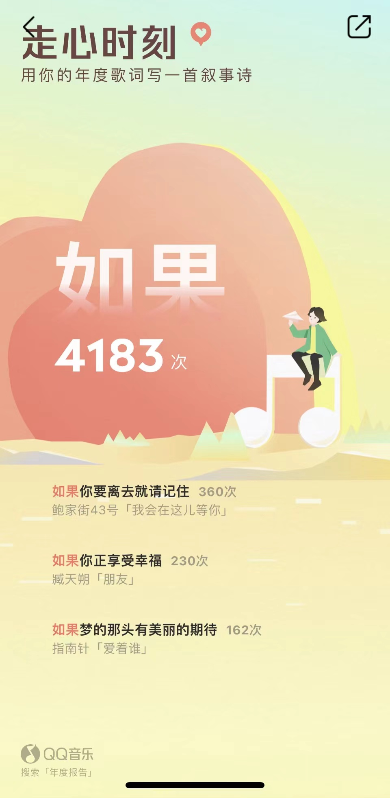

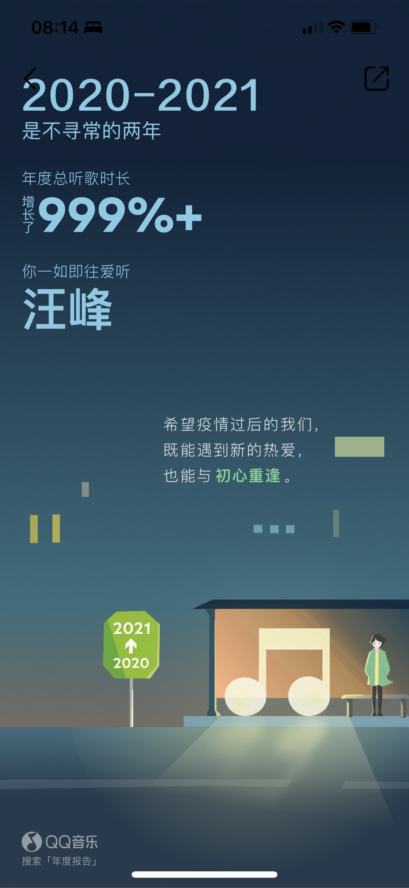

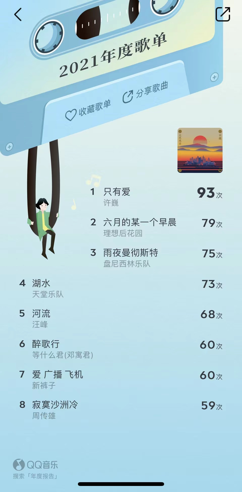

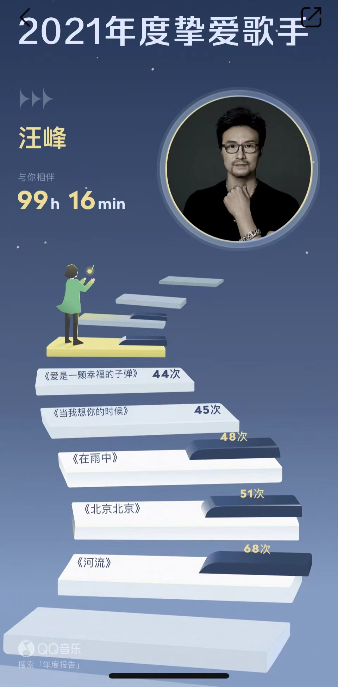

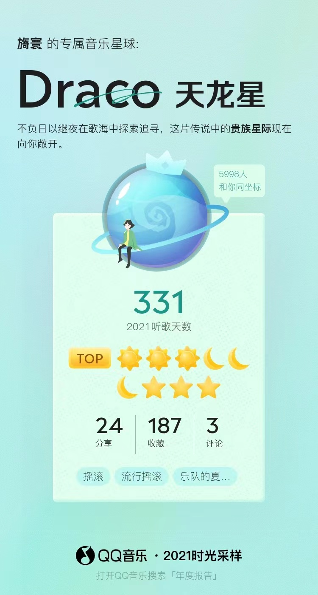

```
未接来电或许是你，匿名的提醒；在模糊的空气里，深陷过去的记忆...

我总想跳进你的圈套，可怎么能就这样输掉...

我要从黎明奔跑到黄昏，去看一看天边的日落；就像是能够逃离这城市，却留不住六月的某一个早晨...

看看他们，看看他们吧朋友！一部分人民压迫另一部分人民的时代！
```

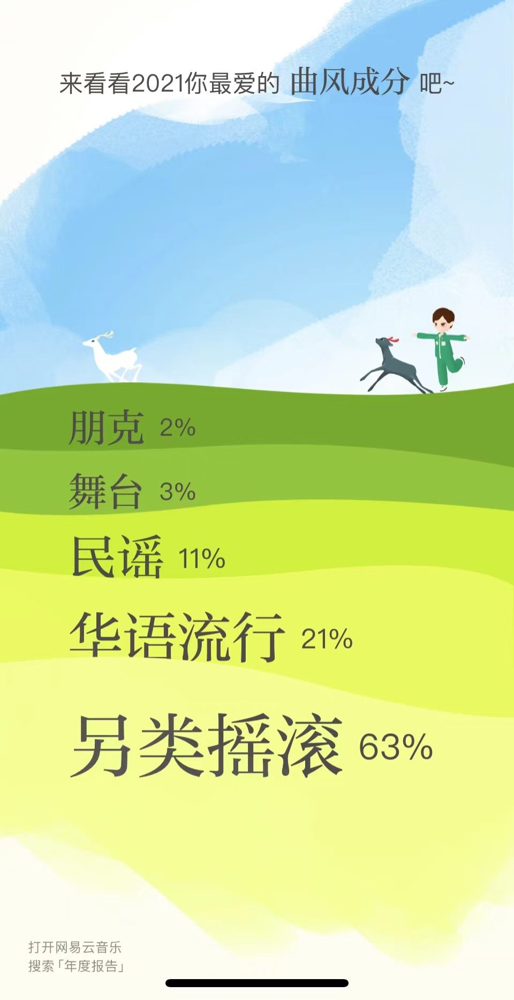

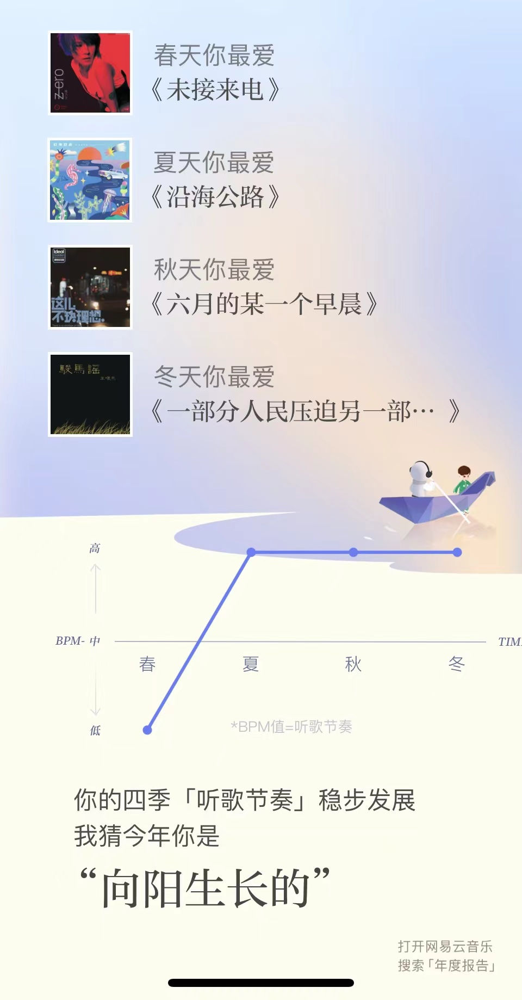

## 读书

```
今年读的书确实少了，也没有那么爱去图书馆了。

或许终究还是陷入了碎片化知识的荼毒，其实很多东西我们只是在追求即时的快感，却最终什么也没有得到。
```

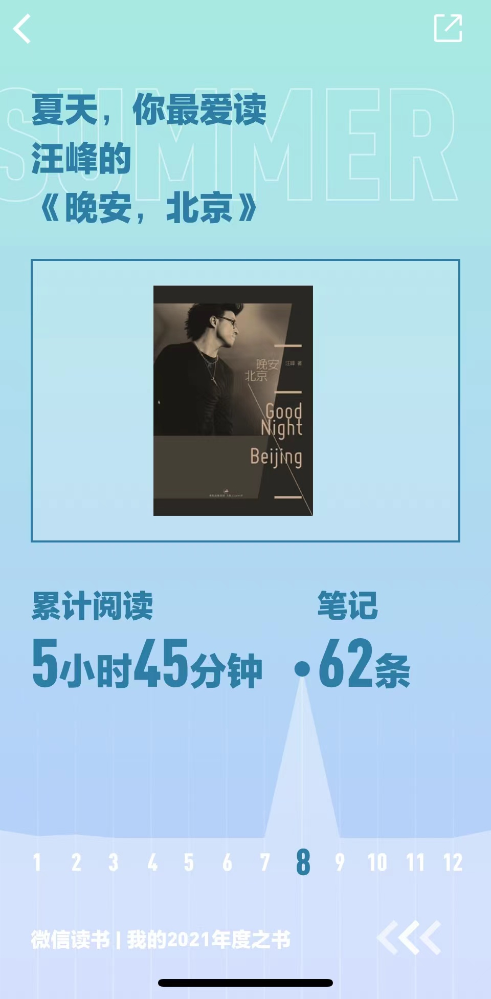

## 旅行

```
南京 -> 宁波 -> 南昌 -> 宁波 -> 北京 -> 杭州 -> 北京 -> 杭州 -> 北京 ->

湖州 -> 北京 -> 南昌 -> 宁波 -> 舟山 -> 宁波 -> 上海 -> 宁波

```

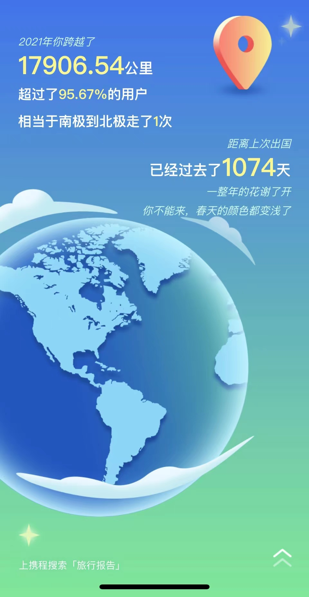

## 吃货

```
在北京几乎点了三个月的外卖，不过还是钟爱家乡的味道。

BTW，铃木食堂的照烧鸡真的很绝。
```

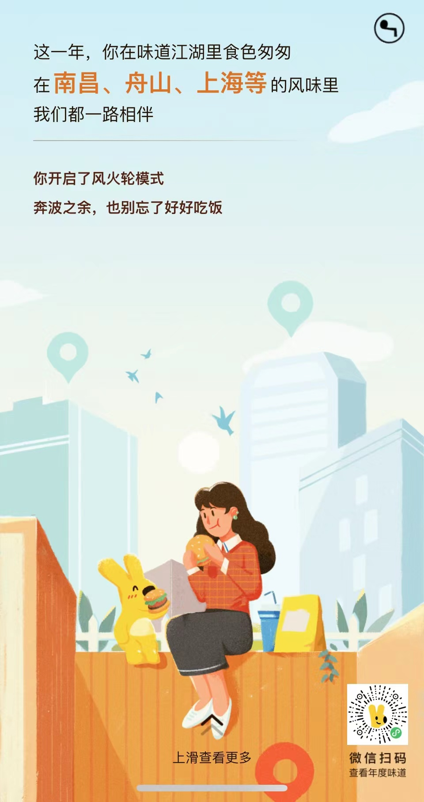

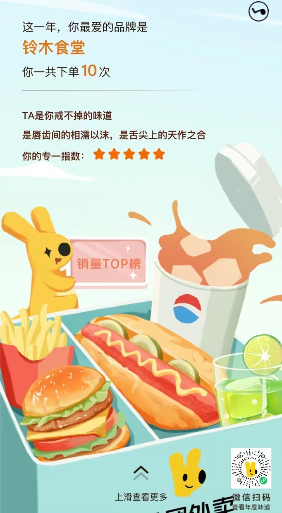

## 锻炼

```
虽然今年很多跑步的数据没有上传，但确实没有前两年跑得多了。

小🐻在2022得好好控制体重了！
```

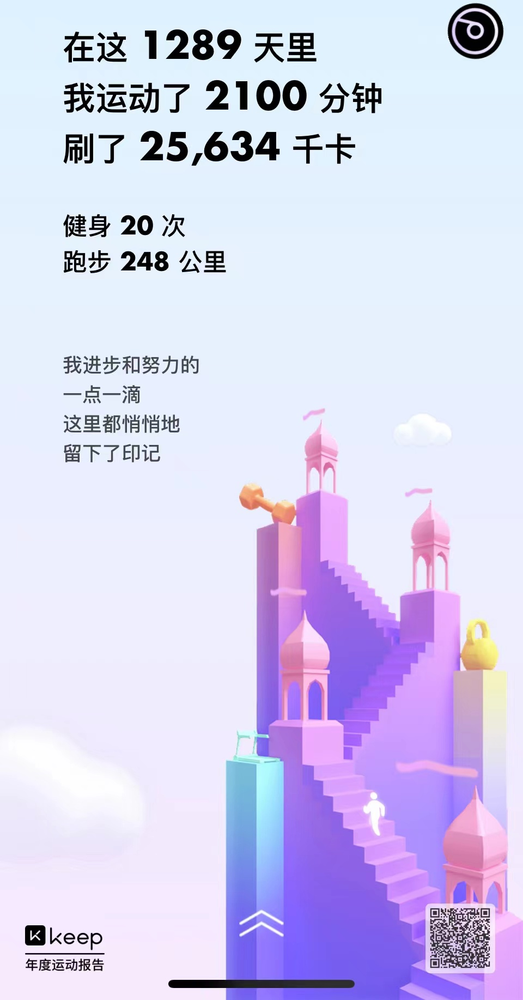

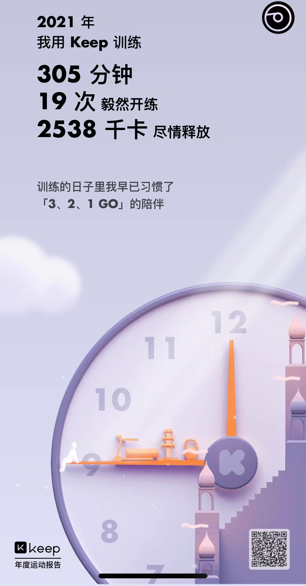

## 文艺青年/泛娱乐

```
依然是个喜欢去 Livehouse 的装逼青年。
```

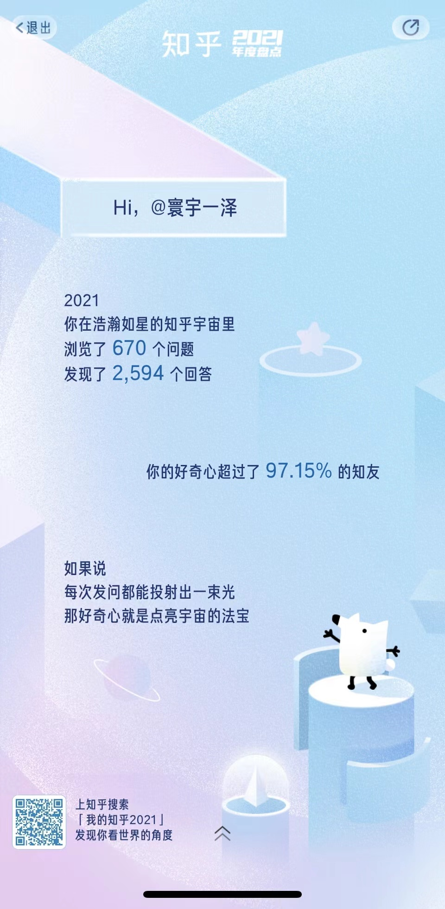

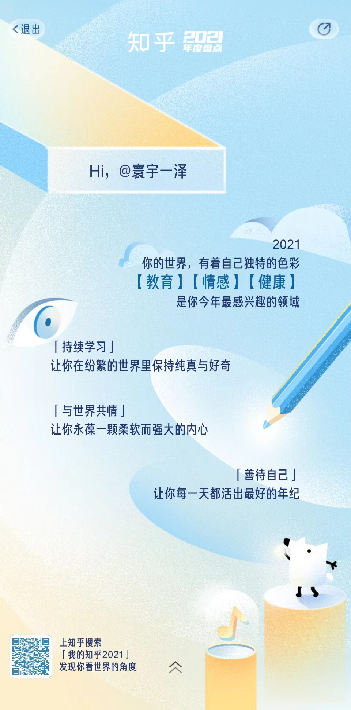

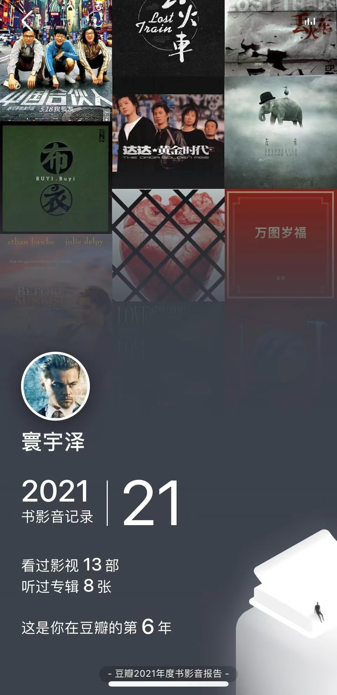

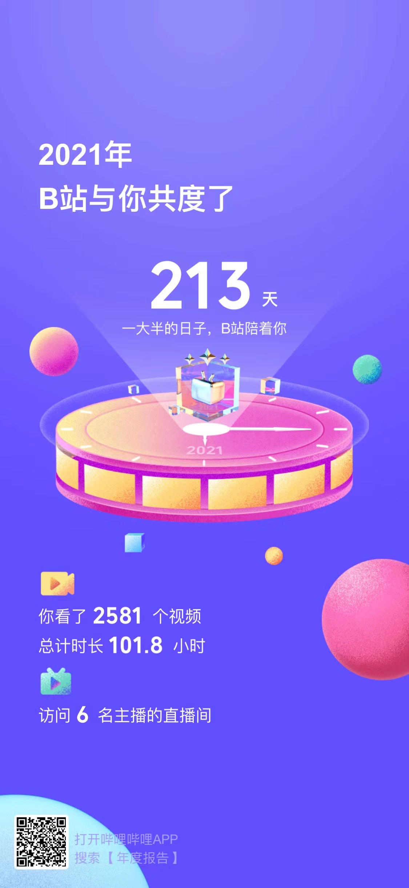


## 程序员

```
希望 2022 在 ucc，uFair，serendipity 和更多项目中收获更多！
```

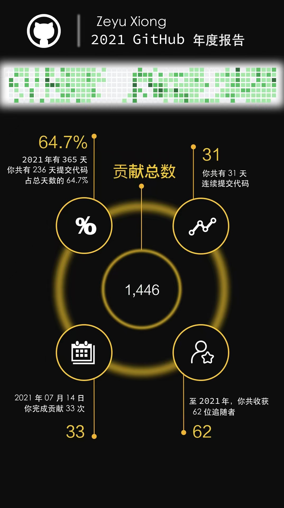

再见，2021👋
