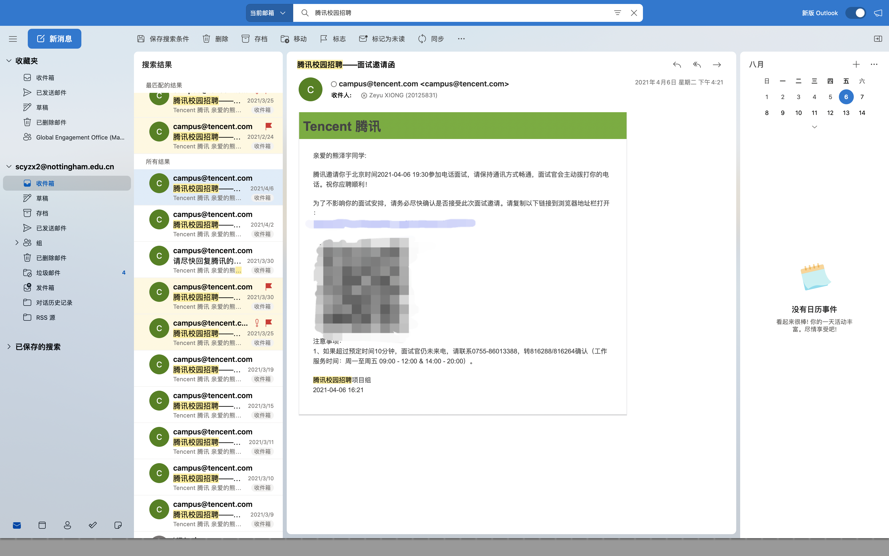

## 引子

事情大概要从 2021 年的二月份开始说起。某日我像往常一样，醒来翻翻微信公众号，看到久未更新的腾讯招聘发了一篇推文：2021 年鹅厂暑期实习提前批正式启动。于是，之前仅有校内互联网公司几个小项目开发经验的我，有点不知天高地厚，跃跃欲试：一方面，是觉得自己终于发现了可以未来安身立命的一项技能：做开发工程师；另一方面，也是想要体验大厂的工作氛围。......于是乎，就有了下面的惨烈场面：

后来我才知道，其实并不是自己被一个部门面了 10 次，而是被很多个部门面过。这就是鹅厂恶心的地方了，如果一个部门不要你，你就会被放回池子里，等着其他部门的人来捞。经过多次的失败，恢复...我发现不能再这么耗下去了。之后我又尝试了阿里，字节，京东，小米，网易，猿辅导......前三个好歹还收到了一面的通知；后三个，直接在简历关就被刷掉了。

经历了此番“毒打”之后，我想是不是也可以去小公司试试看。毕竟如果实力不够，就更需要工作经验方面的锻炼了。于是，我在实习僧上开启了海投模式。

关于想要实习的地点，无非就是三个地方：北京，杭州，上海。原因其实很简单，无非是希望暑假和小罗宝可以待在一起。选杭州上海很容易理解，本来就是我心仪的居住地，而且离小罗宝也不远；北京本不是最佳选择，但小罗宝要来北大夏校，因此纳入了我的选择范围。谁知道阴差阳错，夏校因为疫情改为线上，而我却因为机会的到来，来到了北京。

## 机会

大概是到了四月底，周围已经有一些优秀的同学拿到了某些大厂的 offer，而我一边在应对日益增多的 Coursework，一边还在继续和腾讯，京东，阿里们的面试官们耗着，可以说处于一个非常焦虑的状态。终于，有天晚上一个来自北京的电话敲开了我的机会之门。这位 HR 小姐姐非常耐心，第一次我没接到电话，她又一连打了好几个。可以说是非常有诚意了。
