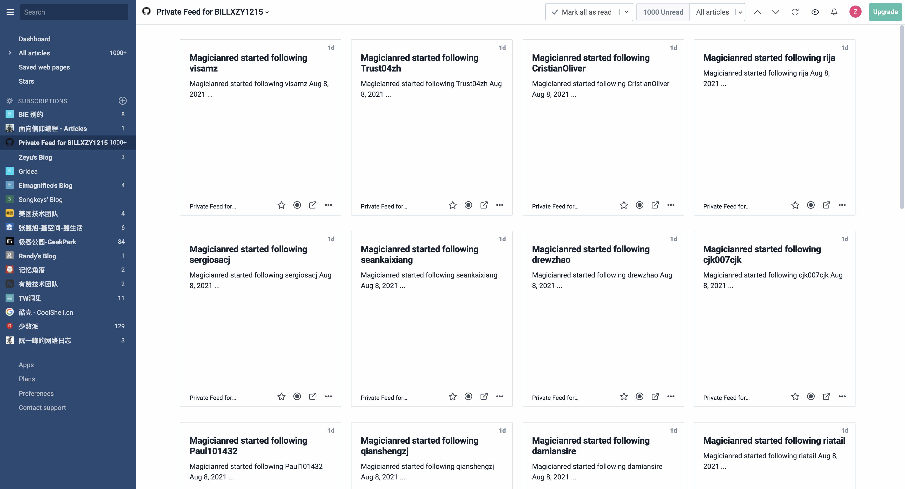
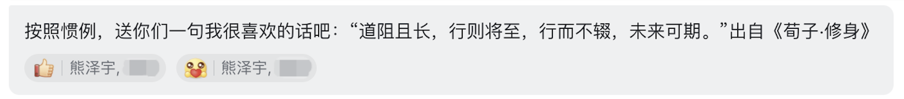

```
如果在不确定的未来中，最差的那个情况已经被你体验过并且熬过来了，那么你一定会对未来充满希望。
```

## 引子

事情大概要从 2021 年的二月份开始说起。某日我像往常一样，醒来翻翻微信公众号，看到久未更新的腾讯招聘发了一篇推文：2021 年鹅厂暑期实习提前批正式启动。于是，之前仅有校内互联网公司几个小项目开发经验的我，有点不知天高地厚，跃跃欲试：一方面，是觉得自己终于发现了可以未来安身立命的一项技能：做开发工程师；另一方面，也是想要体验大厂的工作氛围。......于是乎，就有了下面的惨烈场面：


后来我才知道，其实并不是自己被一个部门面了 10 次，而是被很多个部门面过。这就是鹅厂搞人的地方了，如果一个部门不要你，你就会被放回池子里，等着其他部门的人来捞。不过说实话，还是自己实力不够吧。经过多次的失败，恢复...我发现不能再这么耗下去了。之后我又尝试了阿里，字节，京东，小米，网易，猿辅导......前三个好歹还收到了一面的通知；后三个，直接在简历关就被刷掉了。

经历了此番“毒打”之后，我想是不是也可以去小公司试试看。毕竟如果实力不够，就更需要工作经验方面的锻炼了。于是，我在实习僧上开启了海投模式。

关于想要实习的地点，无非就是三个地方：北京，杭州，上海。原因其实很简单，无非是希望暑假和小罗宝可以待在一起。选杭州上海很容易理解，本来就是我心仪的居住地，而且离小罗宝也不远；北京本不是最佳选择，但小罗宝要来北大夏校，因此纳入了我的选择范围。谁知道阴差阳错，夏校因为疫情改为线上，而我却因为机会的到来，来到了北京。

## 机会

大概是到了四月底，周围已经有一些优秀的同学拿到了某些大厂的 offer，而我一边在应对日益增多的 Coursework，一边还在继续和腾讯，京东，阿里们的面试官们耗着，可以说处于一个非常焦虑的状态。终于，有天晚上一个来自北京的电话敲开了我的机会之门。这位 HR 小姐姐非常耐心，第一次我没接到电话，她又一连打了好几个。可以说是非常有诚意了。初步接触过后，了解到这是一家初创公司，目前在天使轮，做中老年兴趣平台，核心领导来自曾经知乎和豆瓣的创业团队。于是，又加了一轮技术面试后，在面试的结尾，面试官已经给了口头协议，将我招了进来。


## 启程

时间很快就到了六月份。我记得是六月一号，前两天送完小罗宝回家，就只身踏上了去往北京南站的高铁。六小时四十四分，窗外的景色从江南的稻田和工厂，变成北方大片的麦子地和风车。从南站出站，坐 14 号线到北工大西门，时间也不过半个小时左右。背着吉他和极重的黑色大箱子，地面上的空气干燥而闷热，充斥着工业运转与停歇的气息。一路走到四方桥下，这里是京哈高速和东四环的入口，就到了新的住处。

小区是九十年代建成的，这里面的住户由一群北京老大爷大妈和一群租房子的北漂组成。室友也够客气，把朝南的主卧留给了我。小区里的便民早餐店，据说老板娘是内蒙人，一块钱一大碗的豆浆，两块钱一根的大油条，实在是实惠得不行。


周边配套也带着一股老旧小区的气息，传统的饭店，KFC，以及超市。一条西大望路，从北往南，映射的是三种阶级的生活：从最北端的大望路站，SKP-S 代表着商业精英的出没地；中间的九龙山站，合生汇代表着中产阶级的聚会地点；南边的铭泽生活广场，则代表了最接地气的北漂族，附近完全是二三线城市的光景。我所住的地方，就处在合生汇和铭泽的中间位置。


京客隆超市：


东边则是四环外，从弘燕桥望去，欢乐谷的过山车和跳楼机一览无余。


北边，是北京工业大学主校区。正对着的，是工大体育馆，08 年奥运会羽毛球比赛的场地。


离住处最近的地铁站，北工大西门，早高峰时期，门口停满了共享单车：


对这样的生活条件，我还是比较满意。虽说住的没有家里好，每个月多于 3k 的房租，也已经超出了实习工资的 50%，但生活的方方面面也不用太过操心。

## 初识

六月二号中午，在朝阳门打完疫苗，我就去公司报道了。公司坐落于 KASO 的四层，底下两层是 MINI 的 4s 店。


走进公司，第一次看见面我的 HR，萌萌和包子，感觉非常好相处。我的 mentor，同样也是我技术面的面试官 W，穿着一身蓝色 T 恤，架着扁方形的眼镜，一看就是程序员特质。他坐在工位的最里面，和旁边的一位姑娘说着话。后来我才知道，旁边的这位姑娘 X 和我一样，也是前端开发的实习生，目前在法国读研。我身边的位置，是 Z，一米九的大高个，一名前端开发 “老油条”。常常都能看到他和运营产品们撕逼的画面，不过说实话，他也确实有货。写的代码往往思维跳跃，花样百出，让人需要研究很久。加上我，一共四个人，这就是前端 Web 开发团队了。

刚进组，就被分到了写文档、熟悉项目的工作。这三个月，主要都是在做和运营后台相关的事情，也就是公司内部运营用来管理用户、审核作品的 Web 平台。这个项目主要用到的技术栈是 react hooks，函数式编程思想极为强烈。至此我终于明白了为什么说我学过 Haskell 是个加分项了。

看看回家时，公司地铁站门口的晚霞：


六月三号，恰巧赶上公司成立半周年大团建，我随着大家一起，去了黄花城水长城，也在路途中认识了一帮大佬。可能得益于创业团队的自由氛围，老板，主管，技术总监和基层员工之间并没有什么官僚主义气氛。还记得晚宴的时候，老板正好坐我对面。他微笑着递给我一瓶啤酒，可惜昨天刚打了疫苗，只好用饮料代替。面对着知乎和豆瓣的创始团队，和他们开心地聊着知乎和豆瓣的使用体验，以及对我们要做的事情的展望。

## 氛围

对于初创企业，整个环境氛围搭建得还是非常不错的。可以看出来整个团队相对成熟的管理模式，是从知乎和豆瓣带过来的。

每个双月，技术方面会有一次大的总结会。

每周四午休有一次游泳活动：


每周五中午，也会有一次聚餐活动，大家 AA。（在职三个月，公司附近的 颐提港，蓝色港湾，芳园里 都去了个遍 hh）


## 成长

### 第一个难题

进公司没多久，被分到的第一个任务，是开发一个内容搬运账号的创建/更新/内容管理页面。用着以前半吊子和三脚猫的 react 功夫，并且照着其他页面的写法东拼西凑，终于写出了一个功能齐全的页面，但事实上进度已经有所延后了。疯狂地用 state 而不是 url 来控制一个页面跳转的行为也被 Z diss 了很久。那时候我第一次感觉到做项目的压力：不像曾经学校里的 coursework，只要代码能跑就没有问题，还要从代码简洁程度、可维护性等多方面考虑；包括本以为很熟悉的 git 用法，在实际操作上还是出了很大的问题。比如 rebase 操作，以前从来没有接触过，只知道 merge... 在这个过程中，W 和 Z 也逐渐摸清了我们两个实习生的真实水平。导致这以后，涉及重大的功能和模块开发时，我们也只是参与一些小修小补的活动；在功能实现方面，就主要是以看代码为主了。

### 修炼

于是， mentor 决定让我 “回炉重造” 一番：重新读一遍 git scm book；学会写正确的 commit，和简洁的代码；学会构建一个 github 个人主页并熟悉 action 和 CI；学会阅读 RSS feed 中的博客内容；学会发 MR 的 checklist，review 别人的代码；一些优秀的库，例如 chakra-UI, react-hooks-form, react-query 等等。在这个过程中，我才逐渐开始明白一个优秀的程序员，真的都是靠着十年如一日的自学，而且是有方法、有目标的自学。这些宝贵的价值，让我相信写代码这件事，一定可以通过努力来实现，无论你有没有基础，是哪个专业的。只要正确地坚持，它一定可以成为你的一技之长。



### 事故

实习过程中，也遇到了因我而起的一次线上事故。原因是我本以为以及写好了没问题的代码，在线上环境中 API 调用竟然报了 422 的错误。那时候我也赶着下班，在回家路上测试同学发来一条信息说出 Bug 了。我当时还没反应过来，以为是后端的锅。后来才发现，是后端字段在上线前几分钟有了一个修改。这件事也让我明白了上线前不断测试，前后端时刻相互沟通的重要性，以及做开发所要求的严谨性。

### 人际交流

以前以为做程序员只需要写代码，与人沟通的情商方面可以不用太高。经历了一次实习，才知道事实上完全不是这样。和产品运营，需要明确需求；和开发人员，需要明确分工；和自己，需要时刻知道什么该说，什么不该说；什么该做，什么不该做。其实真正到了工作，才明白不像学校那样，一天的全部时间都可以用来写代码；事实上，在 MR 中的 code review，才是代码层面主要的工作。这个地方调用这个库，这种实现方法合不合适？性能是否会受到影响？有没有什么 side effect？发 MR 确定可以 merge 之前，是否已经向甲方明确验收通过？这里面，确实有很多学问。平心而论，我真的还只是个涉世未深的职场新人。

在工作之外，不得不提一位哥，出于隐私考虑我们暂且叫他 D，D 哥的工位在我斜对面，正宗北京人，做 iOS 开发，平常对我和 X 也特别照顾。在我临走前一周，还特地请我吃了烤鸭：


## 尾声

三个月的时间，说长不长，说短不短。我把自己的心态变化按照月份来划分，是这么一个历程：好奇 -> 熟练 -> 怀念。最重要的一点，是我相信以后有自己养活自己的能力了。曾经有人说，如果在不确定的未来中，最差的那个情况已经被你体验过并且熬过来了，那么你一定会对未来充满希望。

北京的夏天还是和两年前一样，干燥而闷热。但我的心境却和两年前完全不同了。如果说两年前是为了来到中国最好的大学体验生活，而现在就是为了体验从校园到进入社会的过程了。从接触公司产品线，到慢慢上手开始写代码，提 MR，和需求方沟通，这整个流程，让我感觉到互联网行业的活力。同时和这一帮有活力的人一起共事，真的很棒。因为他们知道，学历只是一张纸，真正重要的，还是你的能力。

临走之际，mentor 送给我这么一句话：



是啊，无论是软件工程、计算机科学，乃至所有科研岗位，都需要通过不断学习来提升自己。进入这一行，我觉得真的很棒。虽然很多人在谈内卷，可是我依旧热爱它。

夜幕降临，再次走进 14 号线粉色的拥挤不堪的车厢，从望京到南站，形形色色的人们低头玩着手机，有的人在背单词，有的人在看剧；有的人在听歌，有的人在聊微信。可这些人的目的地都一样，那就是：梦想。四方桥上车辆依旧熙熙攘攘；西大望路上人们骑着黄色和蓝色的单车，面无表情，似乎在诉说着一天的疲惫；西二旗，四惠东，忧伤的晚高峰；回龙观的包子铺关上了门，酒仙桥的面馆也锁上了锁。李夏的《离开北京》在耳边响起，伴随我告别这座承载了无数人梦想的地方。

<audio id="audio" controls="" preload="none">
  <source id="mp3" src="./离开北京.mp3">
</audio>

## 附录

记录一些北漂时刻：

一个人的端午节：


从南站出来，打不到车的夜三环和公交站台：


一个人打疫苗：


一个人吃 kfc：


一个人游泳：


一个人路过中关村，两年前的某个夜晚，我同样在这座天桥上，唱起了那首《晚安北京》：


一个人路过鲍家街，想象着二十多年前的地下排练室：


因为突如其来的暴雨，被困在地铁口的人们：


最后用一首歌词来结束这篇博客吧：

```
经过这个批发生产的城市
经过建国门几百万支霓虹灯
经过自动取款机股票终端机
经过城东路旁天使般的少女
经过冰冻的电和分裂的月光
经过放着响屁的高级轿车
经过千军万马似的乌合之众
经过我们将被投入金钱搅拦机的二十世纪末
我眼看着我的精神渐渐崩溃
可我已经无法平衡自己
我眼看着我和这个世界已经瓦解
可我已经无力挽救自己
经过超级市场游乐场和广场
经过电脑芯片和流言组成的机器网
经过欲望风景线映照着的天空
经过濒临疯狂的彻底孤独
经过狂乱的空空如也的一无所有
经过一直凉到脚心底的自暴自弃
经过欺骗获取失去和忘却
经过无数次高潮后痛彻心肺的莫名伤感
我眼看着我的精神渐渐崩溃
可我已经无法平衡自己
我眼看着我和这个世界已经瓦解
可我已经没有力量挽救自己
经过灵魂跳着空虚舞蹈的星期六晚上
经过完美的机器梦里轻声的抽泣
经过镶着金边儿的发着光的打折的自由
经过跳起后飞行可永远不能再落地的失重感觉
经过报纸电话广告牌儿和高架桥
经过香烟屏幕网络和暴风雨
经过街道山脉海和永恒
经过爱和生活经过许多年许多幻想
我们这一代人用青春购买的梦和灵魂
可残酷的变化将大脑洗练殆尽
价格昂贵的虚无日复一日的眼泪
填满了这世界上最优秀的心脏
尊敬的孔子先生此刻你的手正指向何方
我躺在柔软的床上冥想着没有时间的空间
窗外是精疲力尽的未来
所有这一切意味着也许我的人生将是一个玩笑
我眼看着自己越来越不是自己
可我已经无法找到自己
我眼看着自己越来越看不清自己
可我已经没有信心遵从自己
我眼看着我的精神渐渐崩溃
可我已经无法平衡自己
我眼看着我和这个世界已经瓦解
可我已经无力挽救自己
我眼看着自己越来越不是自己
可我已经无法找到自己
我眼看着自己越来越看不清自己
可我已经没有信心遵从自己
我眼看着我的精神渐渐崩溃
可我已经无法平衡自己
我眼看着我和这个世界已经瓦解
可我已经无力挽救自己
```
