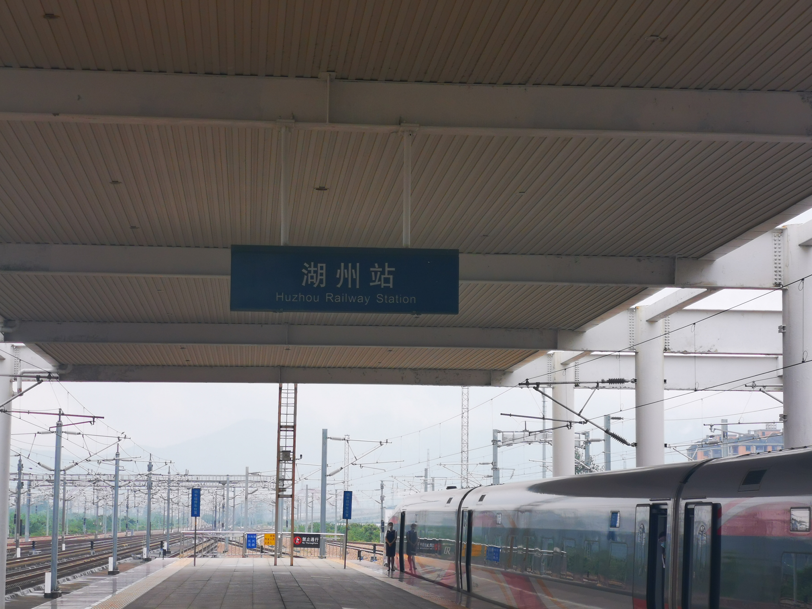
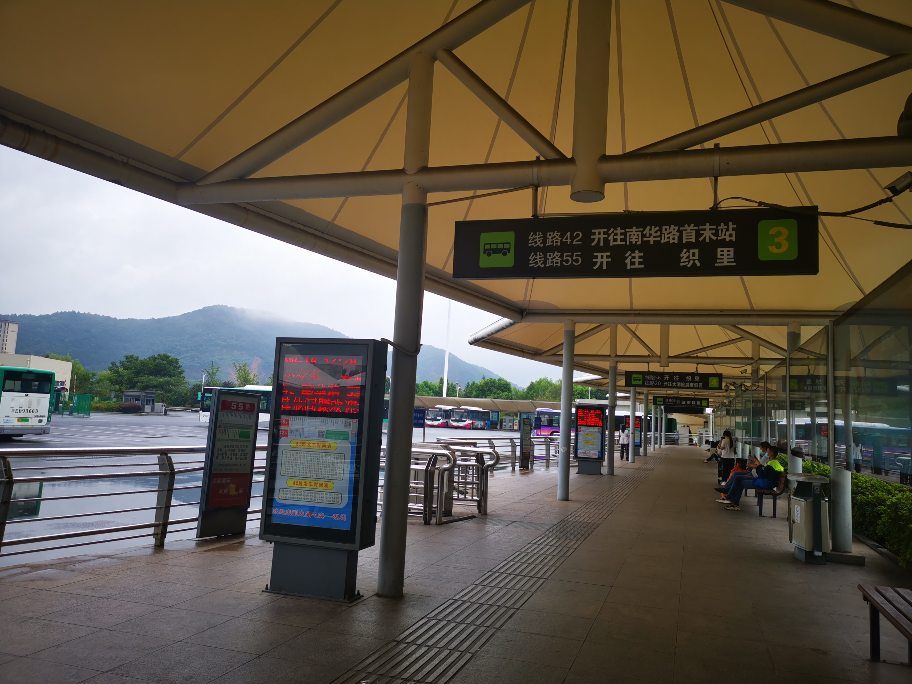
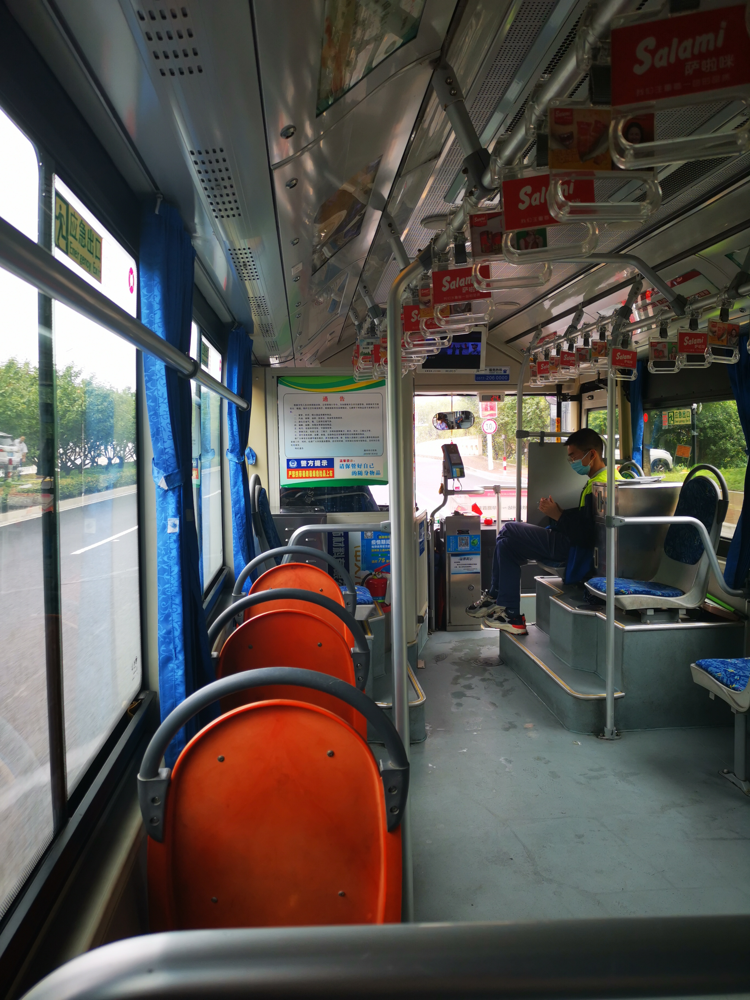
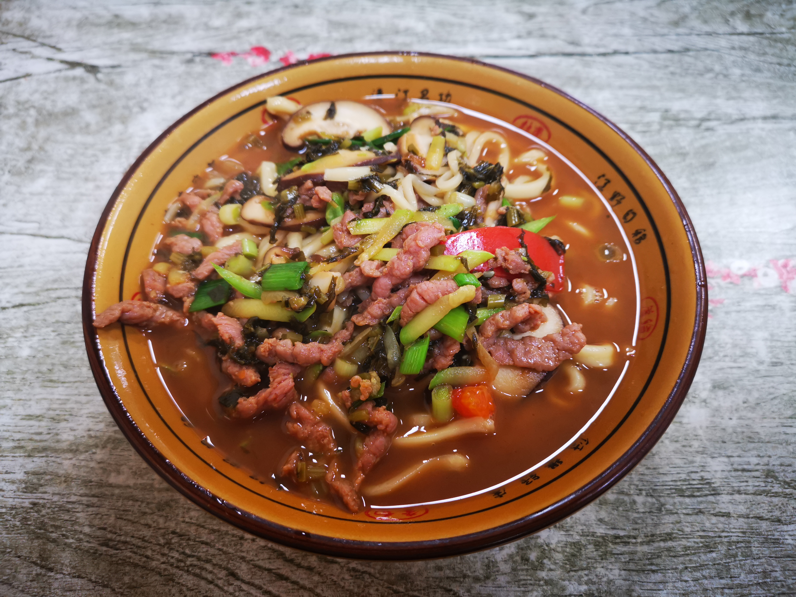
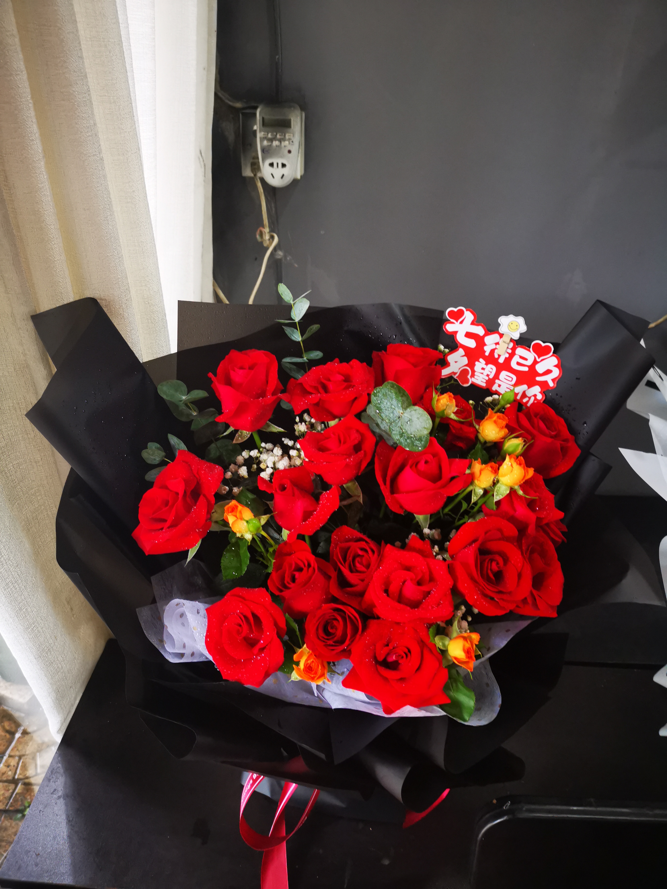
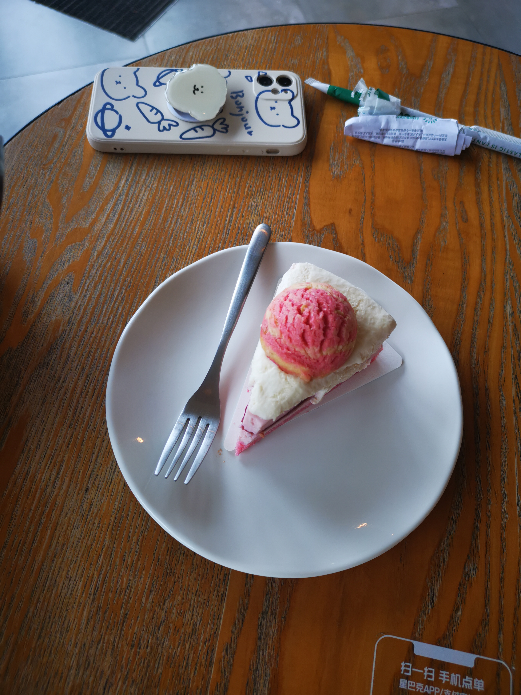
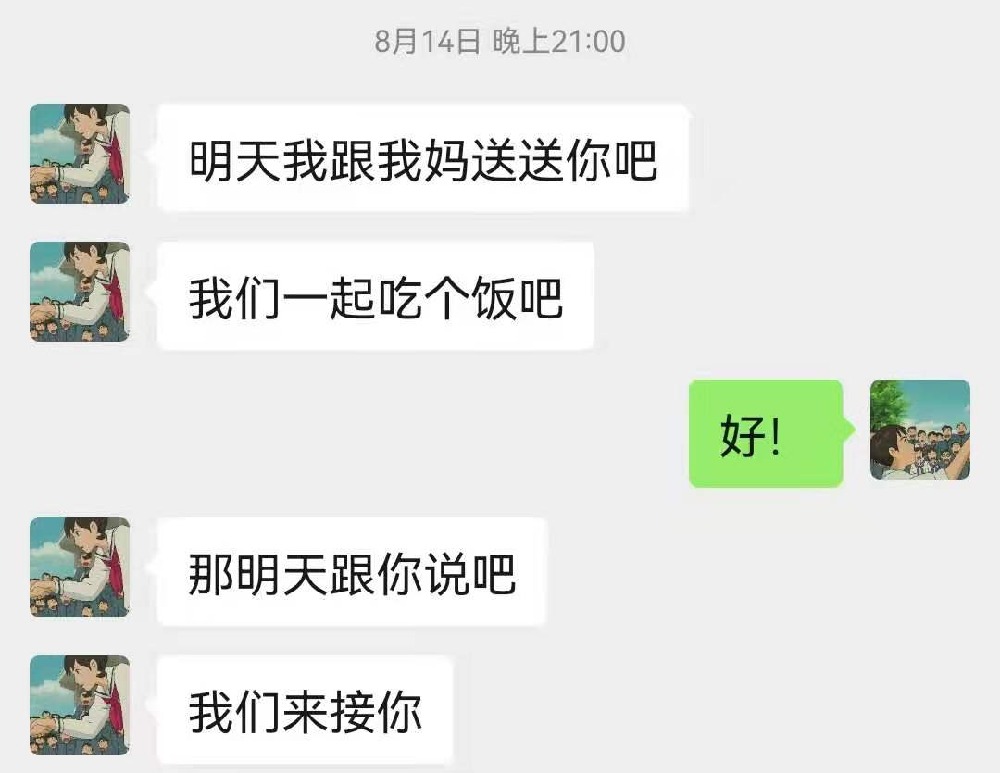
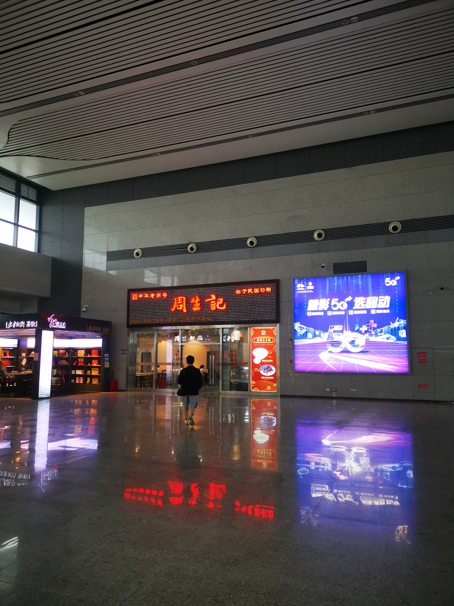

```
什么是真正的爱情呢
我私以为
是如你所是
是超越了物质与世俗的纯粹
```

如果有一天，我毫无征兆地突然出现在你面前，你会是什么样的心情呢？在七夕节的前夕，对于这个问题我并没有准确的答案。但好像对于所有事情，我都可以保持理性的思考，除了爱情。在它面前，我像一只没有被驯化的野兽，满是鲁莽、冲动和不顾一切。于是，我决定做一件疯狂的事情：在明知有疫情风险的情况下，在七夕节，偷偷来到你的城市。这是一件几乎没有考虑任何后果的行为，因为我的脑子里只有一个声音：想见你。

周六就是七夕节了。这天早上我起的异常早，但也不算特别异常。整个这一周，我都比闹钟更早苏醒。六点半，在楼下沙县，简单吃完一碗馄炖，我怀着极度忐忑的心情，直奔北京南站。昨天夜里给你发的消息，你依然没有回复。我不确定你什么时候会在家里，也不确定这样的行为是惊喜还是惊吓。但也正是这种不确定，让我鼓起勇气，去迎接即将到来的一切。

上了高铁，简单补了个回笼觉。睡醒时太阳很大，透过窗户直射进我忐忑的内心，让我睁不开眼。打开地图看了看，快到济南了，路程已经过去了三分之一。刚想去解个手，此时我感到手机振动了一下，你居然回我消息了！第一句话是：“傻子”。当时我的心，就放下了一半了。我从来没有因为别人叫我“傻子”而那么开心过。我好想对你说，傻子现在要来看你了，他已经在路上了，他没办法回头了，他真傻啊。但幸好，我还是忍住了。每个人都会有感性的时刻，爱情的火花迸发的时候，我相信那一刻一定是在单纯地感受对方的呼吸、气息和温度。所以，我下定决心，要把悬念保留到最后一刻。

中午十二点零九分，最新款的智能复兴号停靠在了湖州站。外面下着绵绵细雨，下车的人也寥寥无几。站在车头的乘务员望着拍照的我，似乎在对我说，去吧，既然来了，你就给我勇敢点！



从列车上下来，到只有一个出站方向的地下通道，仿佛回到了儿时，东广场还没开通的老南昌站，只是走出地下通道的人，也特别少。在地下通道的尽头，写着一个牌子：南太湖往左，吴兴往右。正中间是一张桌子，几个防疫人员全副武装，像是要迎接即将到来的审判一样。“哪里来的？行程码出示一下。” “哦北京啊，你最近有没有去过房山和昌平？” “没有啊？你现在要去哪里？” “有三天内核酸证明吗？” 被问到这儿的时候，我心里担心得不行。来之前明明反复查看了北京和湖州的防疫政策，可没有哪里说了要做核酸呀？我只好如实回答 “没有”。本以为要被拉去做核酸了，防疫人员却说：“那你登记一下吧，写个保证书。” 签完字以后，我终于长舒一口气，可以出站了。

按照地图的建议，我应该坐 42 路车去南华路方向。



坐上公交车，周围的景致和别的城市没有什么两样。但从高铁站引出的那条路的路名，引起了我的注意：西塞山路。西塞山前白鹭飞，桃花流水鳜鱼肥...是啊，那首著名的《渔歌子》。司机大声放着伤感情歌，一路上上车的乘客很少很少，路边的人们走路也很悠闲，好像都在享受着午后的安逸。看着路边的光景，真的有一部分太像我小时候长大的街道了。会莫名勾起一阵回忆，也期待着下一条路的神秘。



公交车驶过一座桥，就到了一片住宅区。后来我才知道，这里就是碧浪湖了。虽然建筑有些年代了，但也比较有市井气息。我好像已经很久没有感受到，这么适合生活的地方了。这样的光景，大概只存在于我儿时的记忆中吧。住的地方，在浙北超市的三层，既然是一个人住，那就随便点吧！最重要的，是要离你近一些。简单放下行李，去对面的次坞打面馆，点了一份牛肉汤面。小小的门头，二十块一碗，不算贵，份量也很足。



吃完了面，接下来是去拿花了。地图上显示着，西门离你最近。所以去拿花之前，我决定先去西门看看。很遗憾的是，它被锁住了，看上去不像有人经常出入。我只好回到门口的花店，拿了花，让花店的人假装是送花人，给你打电话。听见电话那头熟悉的声音，当确定你在家的时候，我激动得都快要叫出来了。手上拿着花，我本以为会有门卫会拦住我，然后让你下楼来拿。但我竟然直接就走进了你的小区！我该怎么办呢？直接敲你家的门会不会不太好？万一是你父母来开门这可怎么办呢？我真的忐忑极了。但是除了我自己去敲门，似乎也没有其他办法了。走到楼下我才发现，原来这个楼有好几个单元，我是不知道你在哪个单元的。但我转念一想，既然来都来了，哪怕是一个一个敲门，也要亲自把花送到你手里。



其实，当我敲第一个门的时候，我有点担心会不会是走错了。敲了第一下，好像里面没有什么反应；但敲第二下后，我听到里面传来急促的脚步声。我在想，会不会是你呢？还没回过神来，门瞬间被打开了。我们互相愣了一下，好像是在确认真的是对方。然后我轻声说：“七夕快乐，宝。” 你好像有点吃惊和不解，说：“你这是干嘛？” 但又温柔地说：“你住在哪里呀？” 那一刻的我，是幸福的，是如释重负的。能亲眼看见你，看见你和我说话，我真的太幸福了。

后来的故事，我们都知道了。我们在星巴克吃蛋糕、聊天，你把手臂压在我胳膊上；趁我不注意摸我的胳膊和肚子，看看是不是最近练过了；我把我们俩的吸管搞混了，你说：“亲都亲过了，有什么关系”；去吃火锅等不到座位，我们牵着手一楼一楼地逛着，谈论着最近发生的事，小时候的事，什么都谈。我真的太喜欢这种无拘无束的感觉了，我也能感受到你在主动接受我了，我觉得那纯粹就是发自内心的互相吸引，那就是荷尔蒙迸发的力量。我们在一起，做着再正常不过的事情，逛商场。可就是做这些最正常的事，你在我身边，我就感到真的好幸福！它让我更加确信，你就是我喜欢的人！抱着你的时候，想起你的可爱，你的细心，你的小鸟依人...那一刻我觉得，我可以为你做任何事。



快乐的时光，也总是特别短暂。很快就到了晚上要分别的时刻。在汉堡王，我们坐在一起，喝着可乐。可你的眼泪，却悄悄流了下来。那一刻的我，心情是复杂的。一方面，我再一次感受到了你的用心和认真，让我觉得很感动；另一方面，我也觉得自己的突然出现，给你造成了困扰。就像你说的：“我不希望你来我家是以这种方式，等时机到了，我爸妈会邀请你来的。”是啊，有人说 `喜欢是放肆，爱是克制`，我想我已经明白了喜欢一个人是什么感觉，但要怎么去爱一个人呢？怎么去定义爱这个词呢？有人说 `爱是如你所是，而非我所愿`，我想也很有道理。爱一个人的出发点，不是想要占有她，应该是从她的角度想问题，做一些真正让她快乐和幸福的事。

当我送你到家楼下，看着你默默离去的背影，我看不清你有没有在哭。那一刻我明白，那里才是你的家，你是永远属于家人的。如果我真的爱你，就不要过多地占有你。我想，那就开学再见啦，宝！但后来没过多久，你又对我说：



那一刻，我的内心只有感动和感谢。这是个多么美好的七夕呀！小罗宝和她的家人，是那么努力地在接受我。我也应该，把这份喜欢变成用心去感受，用心去爱。和阿姨在一起聊天，也没有过多的拘束感。真好啊！那么，开学见啦！这份 “鲁莽而疯狂” 的回忆，我也将永远珍藏在心里 ❤️ ❤️ ❤️

附，在湖州站等车的时候，拍到的周生记：



2021 年 8 月 16 日

写于 北京 酒仙桥
