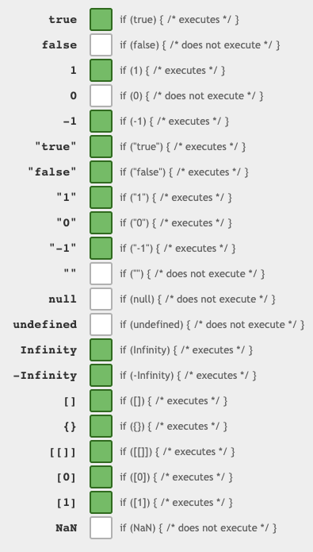
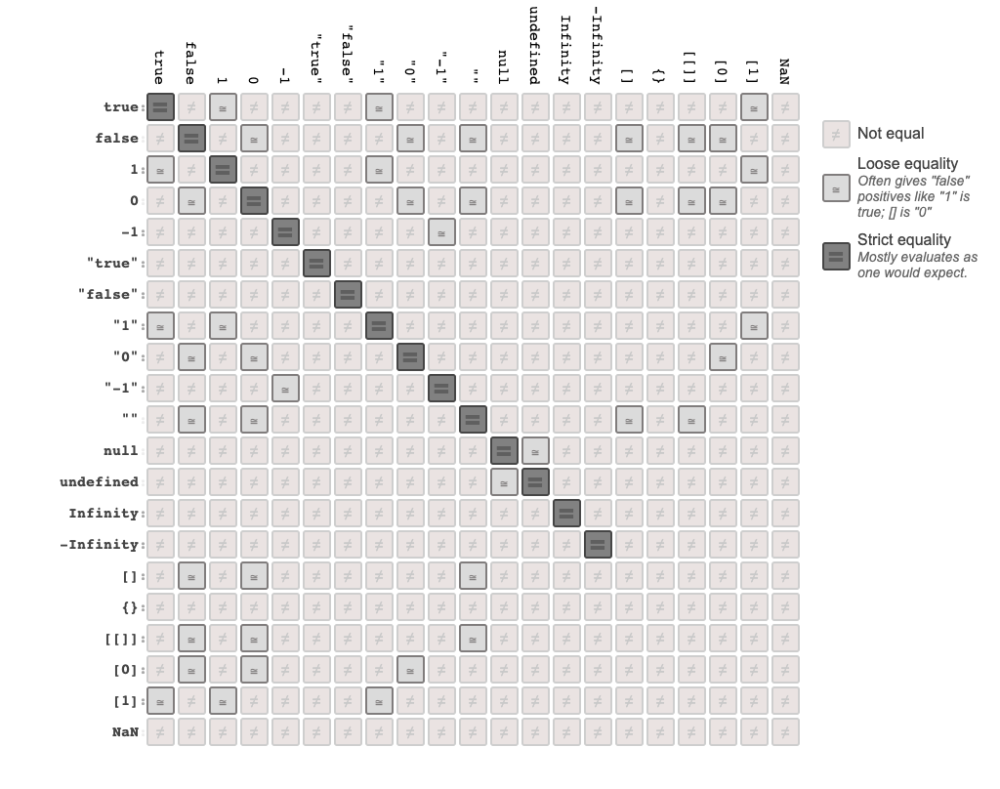

话不多说，直接上图。

## ==

## ===

## If Statements

## Equality in JavaScript (All Table)

## Conclusion

Always use `===` !!!

## Reference

1. StakOverflow: Which equals operator (== vs ===) should be used in JavaScript comparisons?
   [Link](https://stackoverflow.com/questions/359494/which-equals-operator-vs-should-be-used-in-javascript-comparisons?page=1&tab=votes#tab-top)

2. Dorey's Github Page [Link](https://dorey.github.io/JavaScript-Equality-Table/)
