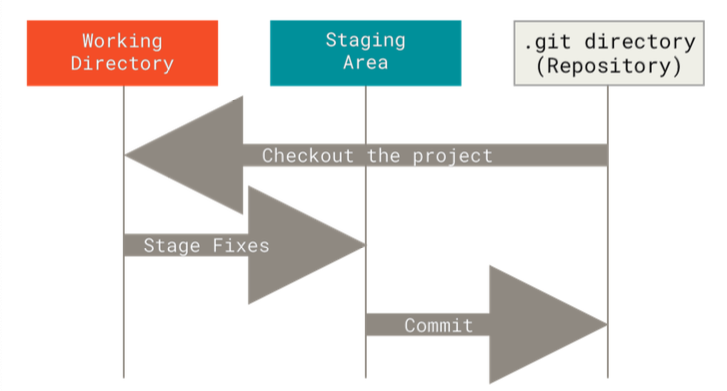
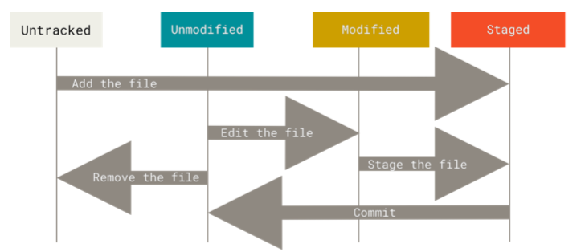
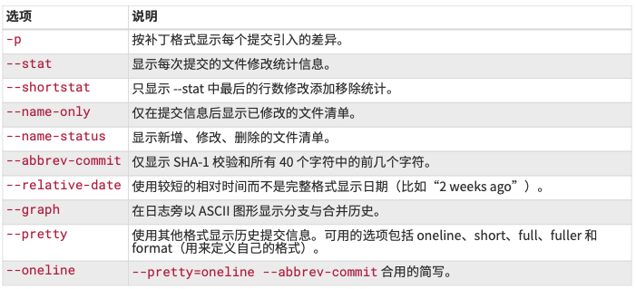
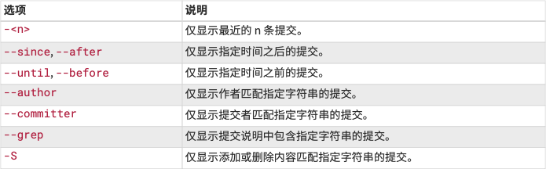
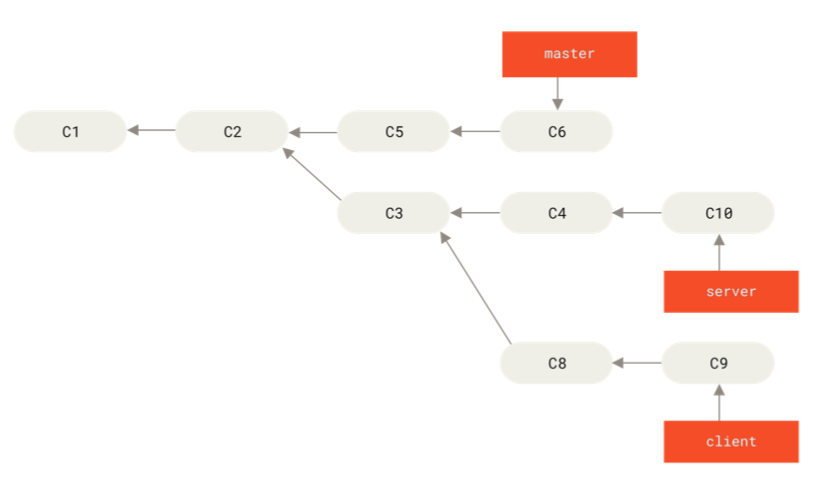
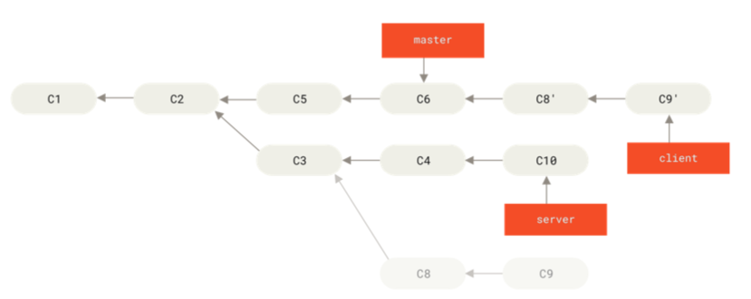
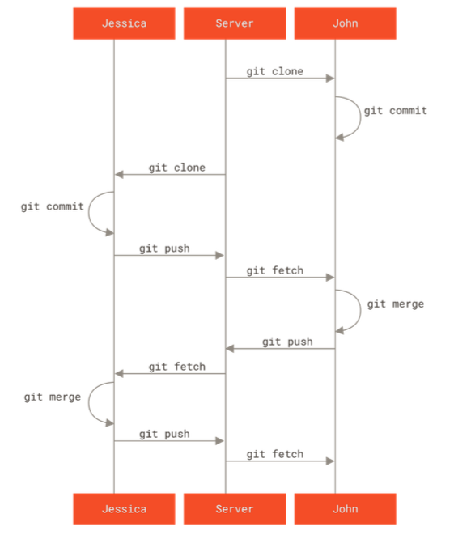

## **工作区域**



工作区：修改文件（modified）

`git add .`

暂存区：对已修改的文件做标记，使之包含在下次提交的快照中（staged）

`git commit -m "xxx";`

Git 目录：数据已经安全保存在本地数据库中（committed）



Untracked File 表示在之前的 commit 中从未出现

### **.gitignore**

glob 模式：

```
# 忽略所有的 .a 文件
*.a
# 但跟踪所有的 lib.a，即便你在前面忽略了 .a 文件
!lib.a
# 只忽略当前目录下的 TODO 文件，而不忽略 subdir/TODO
/TODO
# 忽略任何目录下名为 build 的文件夹
build/
# 忽略 doc/notes.txt，但不忽略 doc/server/arch.txt
doc/\*.txt
# 忽略 doc/ 目录及其所有子目录下的 .pdf 文件
doc/\*\*/\*.pdf
```

## **Git 命令**

### **状态简览**

`git status -s` 获取更为简略的输出

```
  M README
 MM Rakefile
 A lib/git.rb
 M lib/simplegit.rb
 ?? LICENSE.txt
```

- M：已修改 （Modified）

- A：已暂存（Staged）

- ??：未跟踪（Untracked）

- MM：已修改，暂存后再次修改

以 A 为界限，A 上方表示没 add，A 下方表示已经 add，所以 lib/simplegit.rb 文件属于已经 add 的修改，那么就代表它是已经暂存的修改；lib/git.rb 代表新加暂存区的文件；而 README 和 Rakefile 都在 add 上方，表明 README 已修改未暂存，而 Rakefile 有一部分已修改未暂存。

### **查看修改**

`git diff` 和 `git diff --staged（git diff --cached）`

`git diff` 比较的是 modified（未暂存）和源文件之间的差异

`git diff --staged` 比较的是 staged（已暂存）和源文件之间的差异

### **提交更新**

`git commit -a -m 'xxx'` 跳过暂存区，不需要 git add, 直接 commit

### **从暂存区回到工作区**

`git restore --staged <filename>` 把文件从已暂存状态变为已修改 （回到 `git add` 之前）

`git reset HEAD <file>` 同上

### 从工作区回到 unmodified

`git restore <filename>`

`git checkout -- <filename>`

### **删除文件**

`git rm <filename> -f` 强制删除文件（modified 和 staged file 必须-f 才能删除，这么做是为了防止误删尚未 commit 的数据）

`git rm --cached <filename>` 让文件继续保留在磁盘中，但是并不继续追踪 （例如忘记在.gitignore 中添加，并且已经进入了暂存区）

### **移动文件**

`git mv <old_filename> <new_filename>` 改名操作

例如 git mv README.md README 相当于这三步操作：

```
$ mv README.md README
$ git rm README.md
$ git add README
```

### **查看历史**

`git log --pretty=format:"%h %s" --graph`

`git log` 常用选项：



限制 git log 输出的选项：



`git log --pretty="%h - %s" --author='<author_name>'` 显示作者匹配的提交

### **重新 commit**

`git commit --amend` 将暂存区文件提交：适用于在上一次 commit 之后，add 了一些新文件，但是还想沿用上一次的 commit 的情况

```
$ git commit -m 'initial commit'
$ git add forgotten_file
$ git commit --amend
```

### **指定远程仓库**

`git remote add <shortname> <url>`

### **Fetch vs Pull**

`git fetch <shortname>` 访问短称为`<shortname>`的远程仓库，并且抓取当前仓库中没有的内容 （只下载，不合并）

### **切换分支**

`git checkout -b <branch>`

相当于这两步：

```
$ git branch <branch>
$ git checkout <branch>
```

`git checkout -b <branch> <remote>/<branch>` 相当于 `git checkout --track origin/<branch>` 表明新建一个`<branch>`并且将其关联到`<remote>/<branch>`

`git branch -u 或 --set-upstream-to <remote>/<branch>` 表示将`<remote>/<branch>`关联到当前分支

### **变基**



`git rebase --onto master server client`

"取出 client 分支，找出它从 server 分支分歧之后的补丁， 然后把这些补丁在 master 分支上重放一遍"



事实上，rebase 也可能会有 confilct，所以同样需要手动处理，已决定是到底基于哪个 commit 新建的 commit，它和 merge 最大的区别在于 merge 会新生成一条 merge commit，而 rebase 则不会

```
Tips: 想要更改某个 commit 的 Author 信息：
git commit --amend --author="Zeyu Xiong<scyzx2@gmail.com>"
```

### **多人合作**



### Q&A

1. 运行 `git branch -a` 后，发现 list 出来的 remote 分支删不掉 (运行 `git push origin --delete <远程分支名>`) (unable to delete remote, ref does not exist), 这是为什么？

   - `git branch -a` 中的远程分支，并不一定是真正的远程分支。它实际上是一个本地分支，用来 map 到远程分支。(remote branch, is not the branch in the remote repository)

   - 上述情况的发生，很有可能是没有及时 `git fetch`，导致远程分支已经被删掉了（可能 merge request 的设置是默认 merged 后就自动删除这个远程分支），但本地还残留着和它 map 的分支。

   - 执行 `git fetch --prune`, 就可以自动删掉 map 不到远程仓库的，在本地的 “远程分支”。之后，就可以愉快地删除分支了。

2. git push 报错：

```
remote: Password authentication is temporarily disabled as part of a brownout. Please use a personal access token instead.
```

首先需要去 github 上刷一个 secret，然后在 repo 中操作：`git remote set-url origin https://<tour_new_token>@github.com/<git_url>`，现在就可以愉快地 push 了。

---

## Reference

1. [Pro-Git Version2](https://git-scm.com/book/zh/v2)

2. [Password authentication is temporarily disabled as part of a brownout](https://exerror.com/password-authentication-is-temporarily-disabled-as-part-of-a-brownout/)
