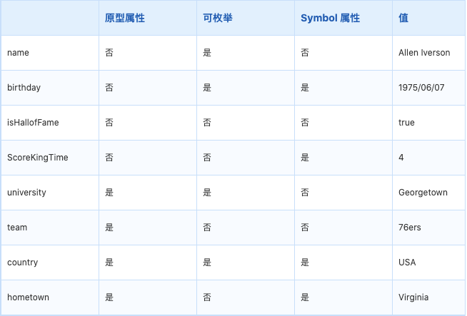
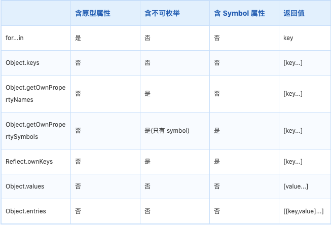

先来个例子：（对象定义）

```
const player = {
  name: "Allen  Iverson",
  [Symbol("birthday")]: "1975/06/07",
};
Object.defineProperties(player, {
  isHallofFame: {
    enumerable: false,
    value: true,
  },
  [Symbol("ScoreKingTime")]: {
    enumerable: false,
    value: 4,
  },
});
Object.defineProperties(player.__proto__, {
  university: {
    enumerable: true,
    value: "Georgetown",
  },
  team: {
    enumerable: false,
    value: "76ers",
  },
  [Symbol("country")]: {
    enumerable: true,
    value: "USA",
  },
  [Symbol("hometown")]: {
    enumerable: false,
    value: "Virginia",
  },
});
```



直接打印：

```
console.log("打印自身可枚举类型: ", player);
// { name: 'Allen  Iverson', [Symbol(birthday)]: '1975/06/07' }
console.log("打印原型中的可枚举类型: ", player.__proto__);
// { university: 'Georgetown', [Symbol(country)]: 'USA' }
```

## for...in...

包含自身以及原型上所有可以枚举的类型，不包含 Symbol 类型

```
for (const name in player) {
  console.log(name);
}
// name
// university
```

## Object.keys

包含自身所有可以枚举的类型，不包含 Symbol 类型和原型上的任何属性

```
const keys = Object.keys(player);
console.log(keys);
// [ 'name' ]
```

## Object.getOwnPropertyNames

包含自身所有可枚举，不可枚举属性，但不包含 Symbol 类型和原型上的任何属性

```
const ownPropertyNames = Object.getOwnPropertyNames(player);
console.log("ownPropertyNames:", ownPropertyNames);
// ownPropertyNames: [ 'name', 'isHallofFame' ]
```

## Object.getOwnPropertySymbols

包含自身所有 Symbol 属性，包括不可枚举的，但不包含原型上的任何属性

```
const ownPropertySymbols = Object.getOwnPropertySymbols(player);
console.log("ownPropertySymbols:", ownPropertySymbols);
// ownPropertySymbols: [ Symbol(birthday), Symbol(ScoreKingTime) ]
```

## Reflect.ownKeys

包含自身所有属性，包含 Symbol 和所有不可枚举的类型，不包含原型上的任何属性

```
const ownKeys = Reflect.ownKeys(player);
console.log("ownKeys:", ownKeys);
// ownKeys: [ 'name', 'isHallofFame', Symbol(birthday), Symbol(ScoreKingTime) ]
```

## Object.values

包含自身所有可枚举属性值，不包含 Symbol 属性和原型上的任何属性

```
const values = Object.values(player);
console.log("values:", values);
// values: [ 'Allen  Iverson' ]
```

## Object.entries

包含自身所有可枚举属性 Key-Value，不包含 Symbol 属性和原型上的任何属性

```
const entries = Object.entries(player);
console.log("entries:", entries);
// entries: [ [ 'name', 'Allen  Iverson' ] ]
```

## Conclusion



- 只有 for...in 可以遍历到原型上的属性

- Object.getOwnPropertyNames 和 Reflect.ownKeys 可获取到不可枚举的属性

- Object.getOwnPropertySymbols 和 Reflect.ownKeys 可获取到 Symbol 属性

## Reference

1. 掘金 微医前端团队 [Link](https://juejin.cn/post/6987537879702437895)
