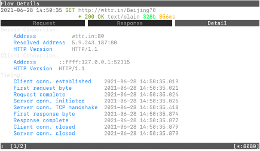

## 什么是 mitmproxy

mitmproxy, 全称是 man-in-the-middle proxy:


是一个交互式的 https 代理，顾名思义，它是用户与网络之间的中间人。它可以帮助我们很好地管理 http 请求，包括测试，更改，拦截等等操作。

目前，mitmproxy 主要可用于三种形式：

- 命令行：包含 mitmproxy 的所有操作

- 用户界面：也叫 mitmweb，界面设计很像 chrome 开发者工具中的 network 界面，但在功能方面是 mitmdump 的阉割版

- Python API: 也叫 mitmdump, `from mitmproxy import http` 可作为模块引入 python 代码，在代码中实现 http 请求

## 为什么要用 mitmproxy

总的来说，是为了保障前后端的分离开发。具体表现有：

1. 后端 API 还未完善，前端为了不影响涉及 http 请求的开发，需要 mock 数据。

2. 前端在测试环境下开发，测试环境中的数据和线上环境有偏差，也可能需要 mock 数据。

## 安装

MacOS:

a. 使用 Homebrew: `brew install mitmproxy`

b. 使用 pipx: `pipx install mitmproxy`

## 基本操作（命令行）

### 启动

安装成功后，在终端中直接输入 mitmproxy 即可开启 mitmproxy 的命令行版本。开启后界面如下：


注意到右下方，表示默认代理的是 8080 端口，也就是说经过 8080 端口发送的 http 请求，都会被 mitmproxy 给记录下来。

### 设置代理端口

在 macOS 中：设置->网络->高级->代理
将网页代理（HTTP）和安全网页代理（HTTPS）的端口改为 8080


这样一来，用户通过网络发送的请求默认都会走 8080 端口，也就是说都能被 mitmproxy 监听到。

### HTTPS 证书设置

当 8080 端口 设置成功后，访问 https 开头的网页会遭到拒绝，这是因为代理不受信任。我们需要给他一个证书：

```
cat ~/.mitmproxy/mitmproxy-ca-cert.cer
cp ~/.mitmproxy/mitmproxy-ca-cert.cer ~/Desktop
```

这样一来新的证书已经在桌面上生成：

添加后还需要设置为 始终信任：


这样一来，就可以访问 https 网页， 监听 https 请求了。

### 链接项目

现在，假设我们的项目在 localhost:3000 中运行，我们希望 mitmproxy 只监听这个项目的 http requst，那么我们可以这么做：

```
mitmproxy --mode reverse:http://localhost:3000/ -p 8080 --set keep_host_header=true
```

然后打开 localhost:8080 现在在 localhost:3000 的项目已经被反向绑定，我们现在可以只监听项目中的 http request 了。这也是 mitmproxy 用于开发的核心步骤。此时，可以通过它去拦截/修改/重做项目中的 http 请求了。但需要注意的是，如果此时电脑中的 http 和 https 代理也设置在 8080，将无法访问任何网页（除了 3000 的绑定页）。

### Python 脚本嵌入

```
http-reply-from-proxy.py

GET_Dictionary = {
  xxx : xxx,
  xxx : xxx,
}

def request(flow: http.HTTPFlow) -> None:
    os_path = os.path.split(os.path.realpath(__file__))[0]
    baseURL = "http://localhost:8080/<api prefix>"
    for key in GET_Dictionary:
        if flow.request.pretty_url == baseURL + key:
            f = open(os_path + GET_Dictionary[key])
            data = json.dumps(json.load(f))
            flow.response = http.HTTPResponse.make(
                200,
                data,
            )
            f.close()
```

在开启 mitmproxy 时，带上后缀 -s http-reply-from-proxy.py, 即可使脚本生效。这个脚本的目的是 match 特定的 http 请求，并将它的 response status 改为 200，response body 改为 data。 详见: https://docs.mitmproxy.org/stable/addons-examples/

### 监听请求

例如，我们新开一个终端，在里面通过 8080 端口发送两个 GET 天气预报的请求：

```
curl --proxy http://127.0.0.1:8080 "http://wttr.in/Beijing?0"
curl --proxy http://127.0.0.1:8080 "http://wttr.in/Shanghai?0"
```


我们成功获取到了北京和上海当前的天气。这时我们返回 mitmproxy，可以看到：


已经成功监听到了这两个请求。

### 查看请求详情

注意到`>>`所指向的就是目前 focus 的请求，可以按 ⬆️ ⬇️ 键来切换 focus 的请求。按 Enter 键查看请求详情（有 Request ｜ Response ｜ Detail 三个模块，按 ⬅️ ➡️ 键进行切换）。




按 `Q` 可以退出详情页。

### 查看快捷键

输入`?`键，即可查看所有内置的快捷键：


### 拦截请求

首先按 `i`，进入命令编辑模式并且自动写好了 `set intercept ''`


在中间加上所需的 filter expressions, 例如： `~u <regex> & ~q`
`~u <regex>`表示只拦截和`<regex>`匹配的 url
`~q` 表示只拦截 request，不拦截 response （具体查看快捷键中的 filter expression）

假设我们想要拦截出现了/Beijing 的 url：`~u /Beijing & ~q`，回车：


可以看到拦截已经被设置成功。
这时，我们再试着在另一个终端发一遍请求：

```
curl --proxy http://127.0.0.1:8080 "http://wttr.in/Beijing?0"
```

你会发现并没有得到北京的天气预报，这是因为这个请求被 mitmproxy 拦截了（在 mitmproxy 中显示红色）：


如果想要取消拦截，只需要在`>>`对应的情况下按下 `a`:


可以看到请求成功了。

### 编辑请求

让我们回到刚刚拦截状态下的请求：
首先回车进详情页面，再按 `e`，会让你选择修改哪个 part:


可以看到从 request 到 response，一切的信息都可以被修改。
例如目前是北京被拦截了，如果想要换成查询湖州的天气，选择 4）path:


回车后，把 Beijing 修改为 HuZhou 然后按 esc 保存，按 q 退回到主页面：


可以看到被拦截的请求 path 已经发生了改变，此时我们再按 a，让请求进行完。


于是，原本请求得到北京的天气，就返回了湖州天气的结果。

Heavy Rain Shower, 想小罗宝了 qwq

## Reference

1. [mitmproxy](https://mitmproxy.org/)

2. [How to Man in the Middle HTTPS Using mitmproxy, Adam Gordon Bell](https://earthly.dev/blog/mitmproxy/)
