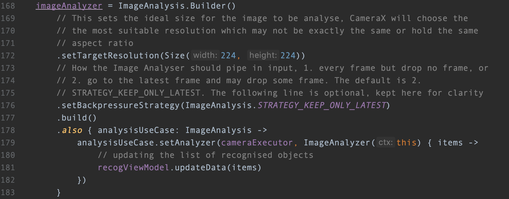
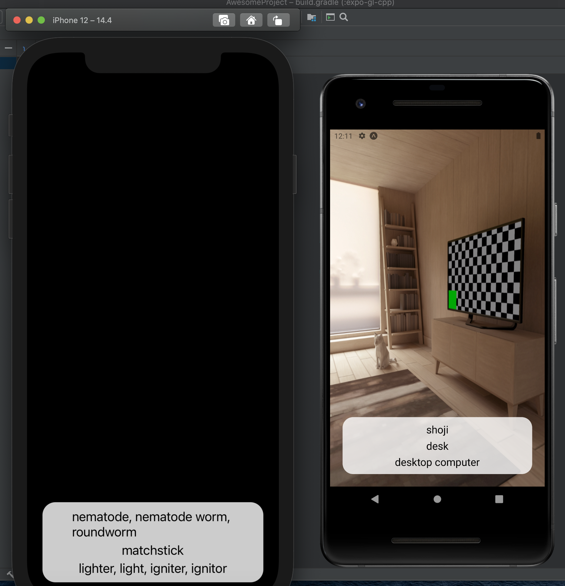
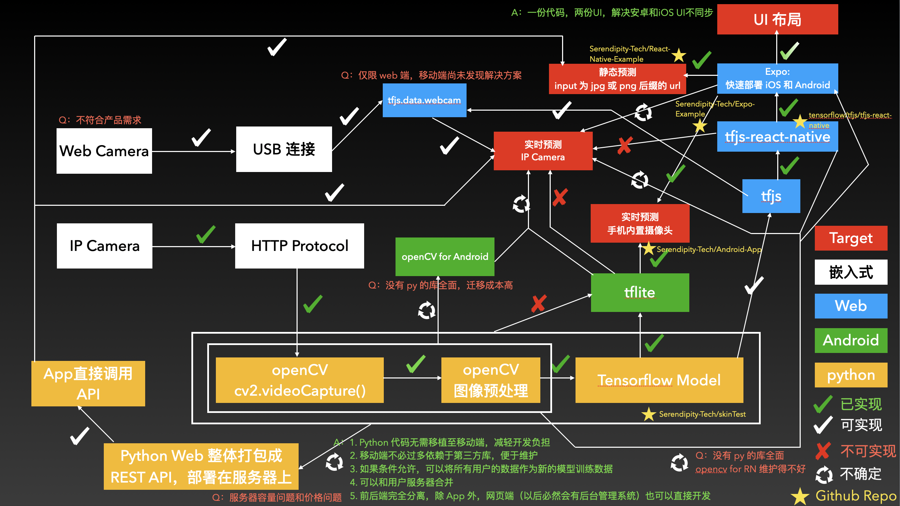
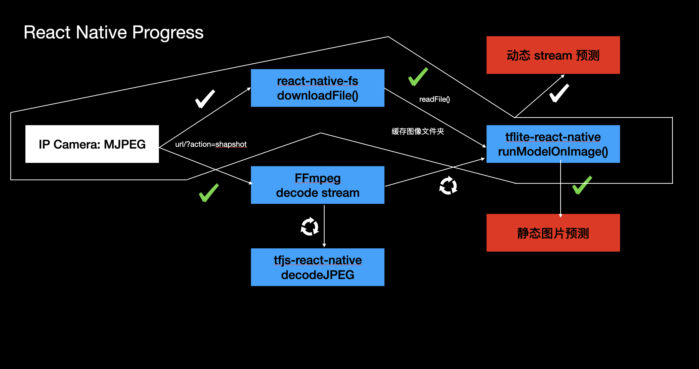

## 引子

这篇博客是针对 react-native 学习笔记的一个补充。说起来研究 RN 也不过半个月左右，我还真是发现别有洞天。之前拿到手的一个需求是，需要在手机本地实时识别一个视频流所拍摄的画面中是否有某种内容。

在加入项目之初，这个团队已经运行了将近半年的时间。在这半年中，团队成员解决了 `tensorflow` -> `tflite`，自己训练了新的模型；但由于手机自带的摄像头并不能满足拍摄的照片情况，因此在嵌入式端（树莓派），做了一个 MJPEG 的 stream，相当于变成了一个 IP Camera，需要在同网络下 GET ACCESS。

事实上，tensorflow 官方的 example 中已经实现了 `手机摄像头实时预测`。所以，交到我手上的任务就是把手机摄像头变成 IP Camera。

## 难题

于是我开始研究 tf 官方的 example，想着下学期也要学安卓开发，就先熟悉熟悉也不是什么坏事。但看过以后我发现，事情并没有那么简单。

一方面，安卓使用的东西封装程度过高，比如 camera 实时预测这个东西，`imageProxy` 和被 override 的 `analyze()` 方法合在一起使用，让人无从下手。因为这看起来是手机自带的 camera 才有的接口。所以，如果直接修改安卓代码，也需要从头开始写起 🤔，这可不是个简单的活儿。

于是我开始在 Github 上大量翻看相关 repo，但遗憾的是，比较优秀的 repo 最多也只能做到 `静态预测`（tflite-react-native），或者 `手机自带摄像头实时预测`（tfjs-react-native）。下面我会一一介绍：

## tflite-react-native

项目地址：https://github.com/shaqian/tflite-react-native

该项目将著名的 mobilenet 应用在移动端的模型 `tflite` 移植到了 react-native 平台上。不过已经有将近两年没有更新了，在用 RN 版本大于 0.6 的时候，iOS 方面会出一些配置上的问题。这时就需要手动 link 一下。在项目主人的 example 中，我看到 ta 已经实现了静态图像预测：从手机目录中选取一张图片 （react-native-image-picker），然后给 tflite model 去跑，并返回得到的结果。

遗憾的是，它不能接受网页 URL 的图片输入，只能接受手机本地。

## expo

官方文档：https://docs.expo.dev/

是一个基于 RN 的项目 builder 和 sdk 集成环境。还是蛮好用的，省去了很多单独 config 安卓和 iOS 的步骤。直接运行 `yarn android` 或 `yarn ios` 就可以 launch 了，这个效率还是可以的，和 flutter 有得一比。在手机上下载 Expo Go，并扫描 launch 出来的二维码就可以直接在手机上看开发的 App 了。也实现了实时热加载。

## tfjs-react-native

项目地址：https://github.com/tensorflow/tfjs/tree/master/tfjs-react-native

API 文档：https://js.tensorflow.org/api_react_native/latest/

这是 Tensorflow.js 官方出的针对 react-native 的库。看起来 google 还是比较重视 RN 这块的（flutter 都没有官方的 tf 库）。

在官方给的 [example](https://github.com/expo/examples/tree/master/with-tfjs-camera) 中，它也实现了 `手机自带摄像头实时预测`。但它调用的 Camera 是基于 Expo 实现的，`onReady` 函数是一个回调，用 iterator 不断产生新的 image。

不过它最大的问题在于调用它的 await function 似乎需要翻墙。。。难道是 tfjs 的服务挂在了 google colab 上？这一点还不太确定。总而言之，目前它不是一个好的解决方案。

## react-native-FFmpeg

项目地址：https://github.com/tanersener/react-native-ffmpeg

项目主人就是开发 `mobile-ffmpeg` 的大佬，真的膜拜。FFmpeg（[官网](https://www.ffmpeg.org/)） 是个完整的跨平台解决方案，用于录制、转换和流式传输音频和视频。可以安装到命令行，在终端当作指令使用。

这个项目相当于把大部分电脑指令移植到了移动端。比如，解码 MJPEG 视频流。（正在研究中）

## react-native-fs

项目地址：https://github.com/itinance/react-native-fs

这是个著名的文件读写库。有了它就可以进行移动端文件的增删改查了。

## 目前的解决方案

在一个周期内，用 `react-native-fs` 下载一张视频流的截图，然后用这个下载的 path 作为 input，输入 `tflite-react-native` 的方法，进行预测后将返回结果打在公屏上。

对于一张 50kb 左右的图片来说，安卓需要 0.4s 左右， iOS 需要 1s 左右（等待优化 ⌛️）。

附：

2021.8.24 项目进展

2020.9.3 项目进展

