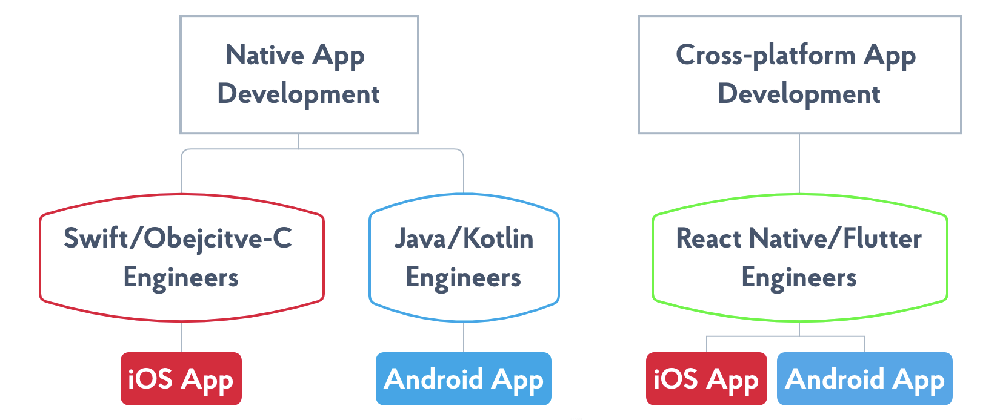
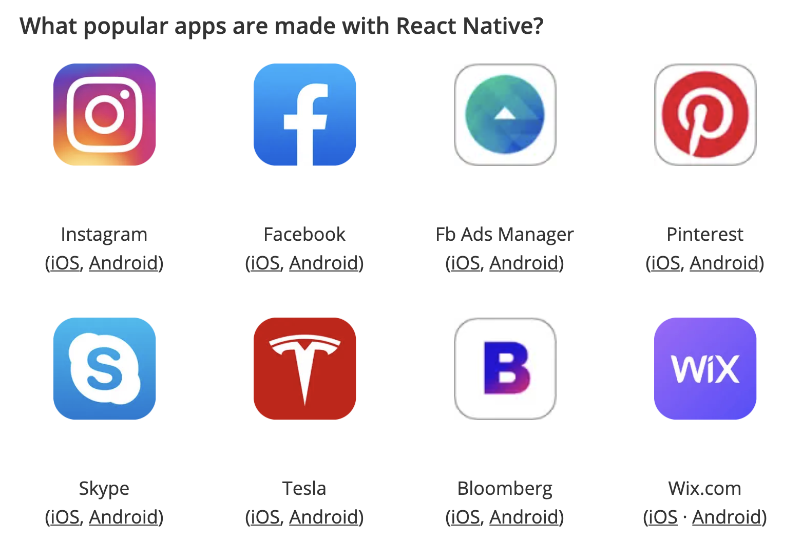

## 引子

前几天接手一个安卓项目，刚一上来就是和 tflite 模型的结合，以及 web camera 的连接功能。这让我一个非安卓开发者着实有点左右为难。另外，这个项目以后肯定也需要 iOS 的支持，于是我就想着得找一个跨端方案。摆在面前的有两个选项：Flutter 和 React-Native。

本着自己是一个 react 开发者，那就先研究一下 react-native 吧！有这些著名的 App 也在使用 react-native：

## Reference

1. [Flutter vs. React Native – What to Choose in 2021?](https://www.thedroidsonroids.com/blog/flutter-vs-react-native-what-to-choose-in-2021)
