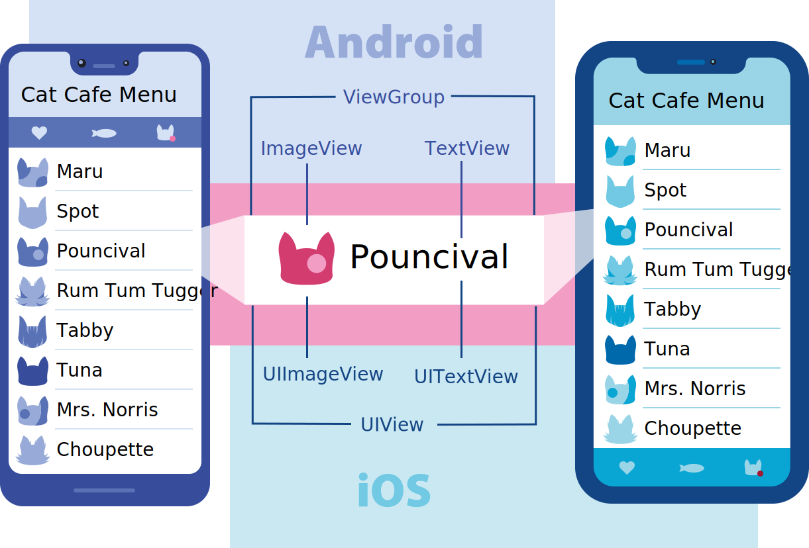

## 引子

八月初接手一个安卓项目，刚一上来就是和 tflite 模型的结合，以及 ip camera 的连接功能。这让我一个非安卓开发者着实有点左右为难。另外，这个项目以后肯定也需要 iOS 的支持，于是我就想着得找一个跨端方案。摆在面前的有两个选项：Flutter 和 React-Native。

本着自己是一个 react 开发者，那就先研究一下 react-native 吧！有这些著名的 App 也在使用 react-native (下文简称 RN)：

官方网站：https://reactnative.dev/

看起来还是不错的。不过在入坑之前，也有朋友提醒我说 RN 的坑很多，一份代码写完，如果单纯用 RN 自有的组件，那 iOS 和 Android 的兼容性就还好。但有些 RN 的外部库，如果很久没有在 maintain 了，就会出一些奇奇怪怪的 bug。

## 直接上手

`npx react-native init <project name>`

自动构建一个 RN 项目。构建完成后，运行：

`npx react-native run-android` 在 Android Studio 上跑 emulator：

`npx react-native run-ios` 在 XCode 上跑 emulator：

语法方面，基本和 react 么有任何区别，这一点，对于一个 Web 开发者，在短时间内学习 App 开发，还是很舒服的。但它的局限性在于，能用的组件很有限。开发一个 RN 组件，需要同时懂 iOS 原生开发，Andriod 原生开发以及 React，相当于要同时维护两个不同端的项目，这样的成本对于开发者来说，说实话有点高。

## 基础知识

Coming Soon...

## 附 比较好用的 RN 库：

1. UI： [React Native Element](https://reactnativeelements.com/docs/)

2. Camera：[React Native Camera](https://github.com/react-native-camera/react-native-camera)

3. Image Picker：[React Native Image Picker](https://github.com/react-native-image-picker/react-native-image-picker)

## Reference

1. [Flutter vs. React Native – What to Choose in 2021?](https://www.thedroidsonroids.com/blog/flutter-vs-react-native-what-to-choose-in-2021)
