This page is used to display the experimental results of FYP.

# Preliminary Results of Groove2Groove

## Attempt1: Direct Conversion

### Piano-Roll-Matrix Based Methods

#### Content Image Input

Album cover of《Amily》

#### Style Music Input

《Fantastic Voyage》, Lakeside, 1981

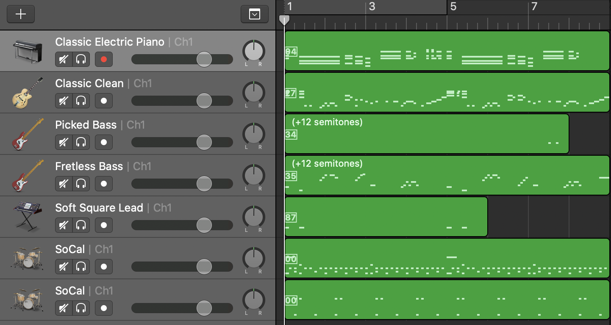

<audio id="audio" controls="" preload="none">
  <source id="style" src="./style.mp3">
</audio>

#### Result: Find Closest + Groove2Groove

Conversion Result:

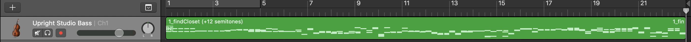

<audio id="audio" controls="" preload="none">
  <source id="1" src="./1.mp3">
</audio>

Final Output:

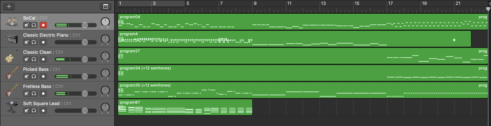

<audio id="audio" controls="" preload="none">
  <source id="1_o" src="./1_o.mp3">
</audio>

#### Result: Triad Mapping + Groove2Groove

Conversion Result:

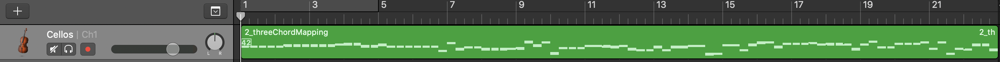

<audio id="audio" controls="" preload="none">
  <source id="2" src="./2.mp3">
</audio>

Final Output:

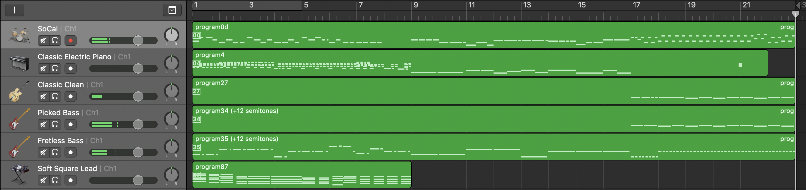

#### Result: Range of Various Instruments (RVI) + Groove2Groove

Conversion Result:

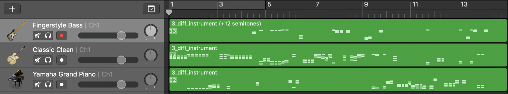

<audio id="audio" controls="" preload="none">
  <source id="3" src="./3.mp3">
</audio>

Final Output:

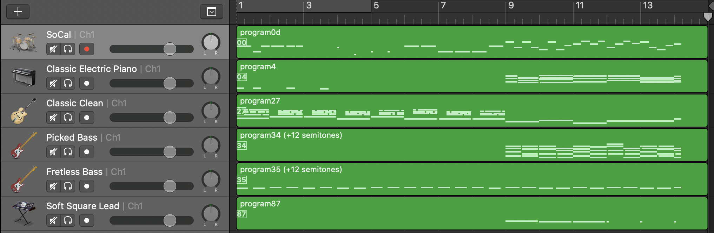

<audio id="audio" controls="" preload="none">
  <source id="3_o" src="./3_o.mp3">
</audio>

#### Discussion: Duration -- crucial factor

Final Output of RVI (duration = 0.2s = style duration)

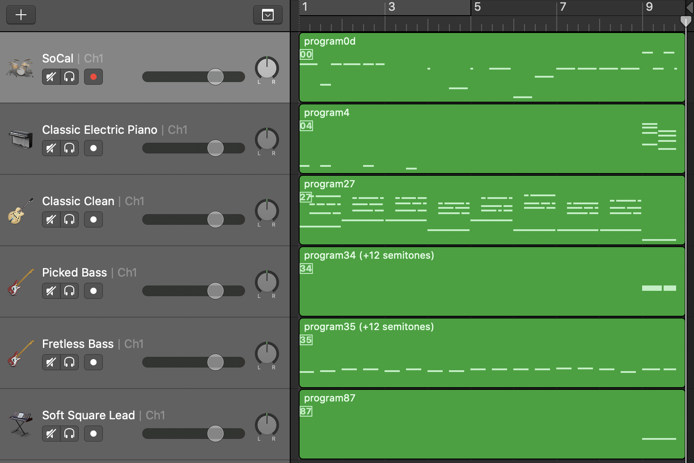

<audio id="audio" controls="" preload="none">
  <source id="3_o_0.2" src="./3_o_0.2.mp3">
</audio>

Final Output of RVI (duration = 1s)

<audio id="audio" controls="" preload="none">
  <source id="3_o_1" src="./3_o_1.mp3">
</audio>

Final Output of RVI (duration = 2s)

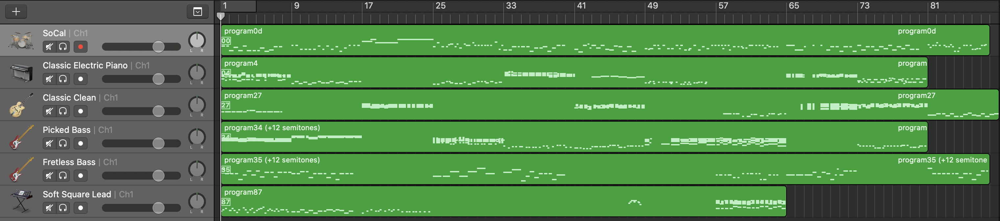

<audio id="audio" controls="" preload="none">
  <source id="3_o_2" src="./3_o_2.mp3">
</audio>

### Color Based Methods

#### Content Input

Album cover of 《The Dark Side of the Moon》.

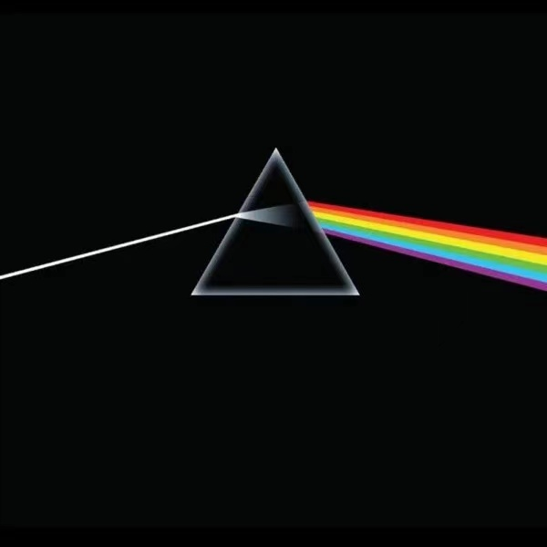

#### Style Input

《Fantastic Voyage》, Lakeside, 1981

<audio id="audio" controls="" preload="none">
  <source id="style" src="./style.mp3">
</audio>

#### Result of Color + Chord Progress + Groove2Groove

Conversion Result:

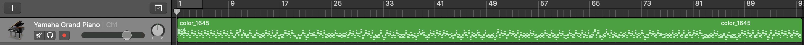

<audio id="audio" controls="" preload="none">
  <source id="4" src="./4.mp3">
</audio>

Final Result:

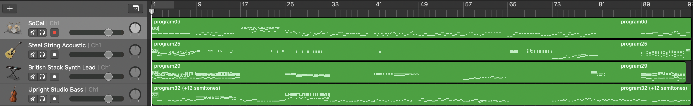

<audio id="audio" controls="" preload="none">
  <source id="4_o" src="./4_o.mp3">
</audio>

## Attempt2: Content Extraction

### Content Image Input

### Style Input

#### Blues

<audio id="audio" controls="" preload="none">
  <source id="Blues" src="./Blues.mp3">
</audio>

#### Country

<audio id="audio" controls="" preload="none">
  <source id="Country" src="./Country.mp3">
</audio>

#### Electronic

<audio id="audio" controls="" preload="none">
  <source id="Electronic" src="./Electronic.mp3">
</audio>

#### Jazz

<audio id="audio" controls="" preload="none">
  <source id="Jazz" src="./Jazz.mp3">
</audio>

## Appendix

### Video Resource of 《Amily》

<iframe width="560" height="315" src="https://www.youtube.com/embed/iVvkqHwX9Ds" title="YouTube video player" frameborder="0" allow="accelerometer; autoplay; clipboard-write; encrypted-media; gyroscope; picture-in-picture" allowfullscreen></iframe>

### Video Resource of 《Fantastic Voyage》

<iframe width="560" height="315" src="https://www.youtube.com/embed/-1YjmXSyHa8" title="YouTube video player" frameborder="0" allow="accelerometer; autoplay; clipboard-write; encrypted-media; gyroscope; picture-in-picture" allowfullscreen></iframe>
