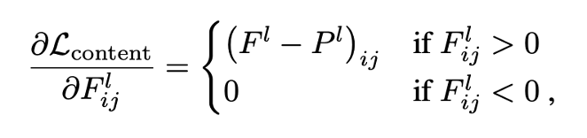
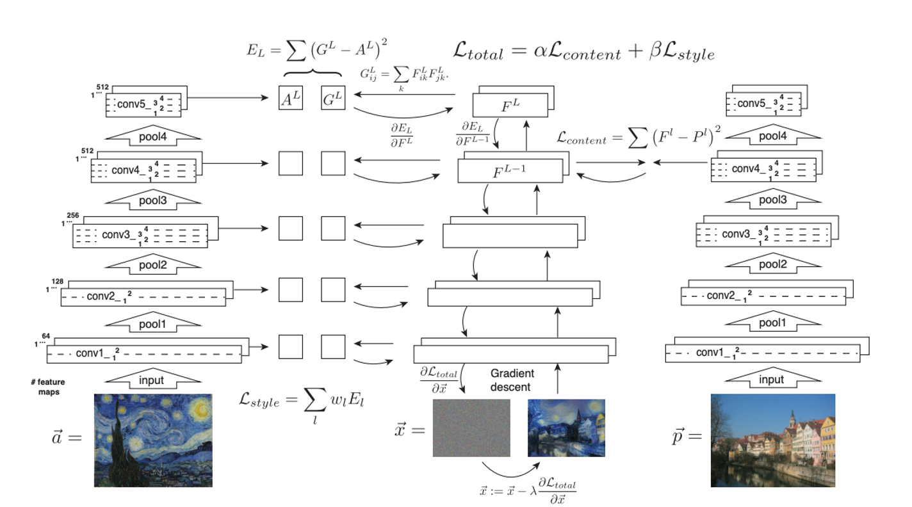

一个多月没更新了，开学以后总是有各种各样的琐事。不过好在大四确实没什么过重的课程，主要还是把重心给放在毕业设计上。这一个月和 Amin 聊天，聊着聊着就决定要把 Music 和 Image 结合起来，做一个 novel 的 work 出来。主要还是因为，纯 AI Composer 想要发 paper 还是比较困难的，很多 work 的复杂程度还是不在我的能力范围之内。而凭借一些三脚猫的 CV 知识，就打算把 CNN based 图像处理和 RNN based 自然语言处理（symbolic data of music）结合一下，搞点能 publish 的 work！

## Intro & Motivation

先来看一下这篇 paper 在干什么吧：图像风格迁移。下图中的钢铁侠，是 content image；梵高的画《星空》，是 style image，最终生成了“星空”风格的钢铁侠。

其实风格迁移，本质上是一个 Texture (纹理) transfer problem，在现有方法中，大多都只能实现 low-level 的图像特征提取，对于不同风格的语义化提取还是比较困难的。这篇 paper 的主要贡献就在：把语义提取变成了神经网络中损失函数的最优化问题。

## Encoding: Deep Image Representation

### Content Representation

F（对于生成图像）和 P（对于原始图像）代表 Content 的内容。假设在 layer l 中有 N 个 filters，M 代表每个 filter 的尺寸（长\*宽），那么 F 和 P 就是 一个 N \* M 维的矩阵，F 的下标 i，j 代表在 layer l 中 第 i 个 filter 在 j 这个位置的 activation。例如一张 RGB 图像，为 3\*255\*255，那么代表有 3 个 filters 和 255\*255 的尺寸。Content Loss 函数及其导数表示如下：

### Style Representation

G（对于生成图像）和 A（对于样式图像）代表 style 的内容。G 的下标 i，j 代表：在 layer l 中， filter i 和 filter j 在相同位置下 activation 的乘积之和（遍历所有位置）。E 则代表了类似 Style Loss 函数的子项（对每一层 layer 而言，N 与 M 对应 content representation 中的定义，在这里作为归一化的参数）。

同样，style loss 函数 (w 用来决定每一层的权重) 以及其导数被定义如下：

### Style Transfer Algorithm

这里就到了算法的核心部分，左图代表 style image，右图代表 content image，中间这张图是 generated image。我们可以观察到，从 content image 的卷积层中，随机抽取一层，将它的 content 与 generated image 进行 loss 计算。而 generated image 与 style image 的每一层都存在 loss 计算。根据它们的导数，我们进行 back propagation 来调整梯度下降的学习率。我们的最终目标，是要把 total loss（公式如下，是 style loss 和 content loss 的线性组合）降低到最小。

## Result

接下来，让我们来看看结果：

A 是原图（content image），B 的风格源于特纳的画《米诺陶战舰的倾覆》，C 的风格源于梵高的画《星空》，D 的风格源于蒙克的画《Der Schrei》。

在参数方面，a/b 的值：B 为 0.001，C 为 0.0008，D 为 0.005。这三张图都是从原图的 `conv4_2` 这一层 match 的 content loss，而在 style loss 方面，`conv1_1`，`conv2_1`，`conv3_1`，`conv4_1`，`conv5_1` 的权重 w 被设置为 0.2，其他层被设置为 0。

## Discussion

在这里我们主要讨论影响生成图像质量的因素。

### Trade-off between content and style matching

a/b 的值会影响图像的表达，这个值越小，越偏向 style image，反之越偏向 content image。还记得之前的 A 图吗，我们依然把它作为 content image，将下图作为 style image：

下面是在不同的 a/b 比值下的结果（结论应该一目了然）：

### Effect of different layers of CNN

实验证明，在 high layers 来 match content loss 所生成的图像更加平滑。例如我们将下图作为 content image:

在不同 layer 进行 match 所得到的结果（`conv2_2`为 low layer，`conv4_2`为 high layer）：

### Initialization of gradient descent

生成图像最开始的样子应该是 content image？style image？还是某些有白噪声的 image？

A 为初始化为 content image 的最终结果。

B 为初始化为 style image 的最终结果。

C 为初始化为 white noise image 的最终结果。

### Photorealistic style transfer

如果 style image 不是抽象画，而是一张真实的照片，怎么办？我们的算法依然可以做到：例如下面展示的，content image 是白天的伦敦，style image 是夜晚的纽约，最后生成夜晚的伦敦。即使生成的图像没那么真实，但整体色彩和内容还是很到位的。

## My Thought

1. 第一眼看到图像风格迁移，我以为是手动标记一些 label，然后在神经网络中去 predict 某张图片属于什么 label 并与之匹配，融合。结果没想到不需要手动标记 label，完全是在直接进行两张图片的融合。这对于数据收集耗时问题是一个很大的帮助。

2. 关于 evaluation 的问题，因为艺术创作本来就没有标准答案，属于这块可以做得比较模糊。萝卜青菜各有所爱，大不了做一些 investigation 来当作 evaluation 也未尝不可。

3. 可以试着换一个神经网络结构去重新做实验，看看效果是否会更加明显。关于各种参数影响生成图像风格的讨论，还可以分得更细。例如，对于风格是抽象画的作品，什么 a/b 的比值和 activation layer 会比较好，反之，对于现实主义的画作，甚至是拍摄作品，怎样的参数又会更加合适。

4. 给 FYP 的启示：核心算法还是一个 loss optimization 的问题，主要是要研究一下 music encoding 和 image encoding 中有哪些共性可以转换。
