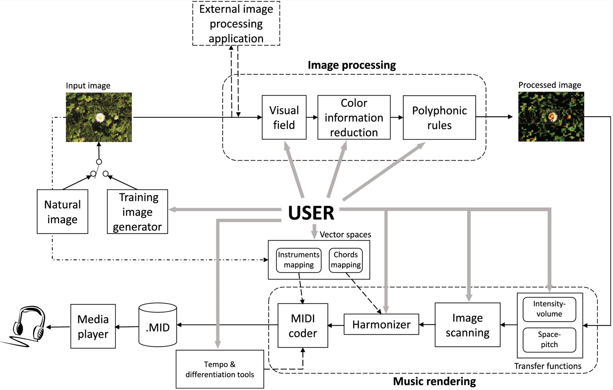
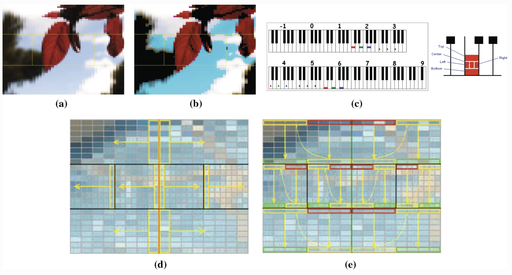
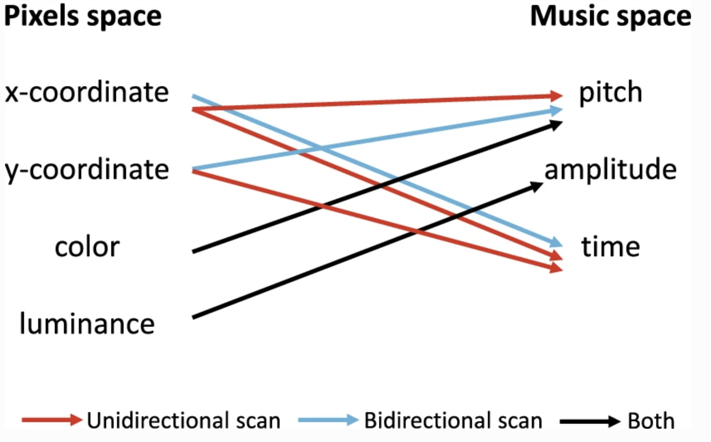

## 概述

这篇论文主要在讲图像声波化：通过声音来表达视觉数据。
第一步，图像处理：在其中心区域对图像进行更详细的采样，并对其周围地区进行消减。
第二步，颜色显著性检验：将出现概率小的颜色视为噪声，清除掉。
第三步，颜色-音符转换：每个像素中的 RGB 值最多可以转换为三个同时出现的音符，其振幅取决于每种颜色强度。

对于 Music Vision (MV) 的用户来说，可以交互式地选择：

- 如何处理输入的图像（如如何使用颜色信息，或更详细地处理哪些图像区域）和转换为音乐（如如何使用 MIDI 复音资源）
- 如何将颜色与和弦和乐器相匹配
- 如何将图像区域映射到不同的八度音

在性能评估方面，作者做了用户测试。测试者需要从 MV 产生的音乐中，识别出低分辨率图像中的简单颜色图案。结果表明，即使没有受过音乐训练的用户也能在多项选择测试中以 70%的准确率选择与渲染的曲子相对应的图像。此外，受过一些音乐教育的用户也能够在没有其他刺激物的情况下，通过 "耳朵 "绘制出高精度的图像。

## 设计原理

对于一个给定的图像，MV 应该能够产生相当不同复杂程度的声纳，其参数可以由用户随意改变。

- 在每个像素的基础上，中央视觉比周边视觉能更有效地识别场景要点（即中央视觉需要更少的信息来达到与周边视觉相同的要点识别性能水平），因此，MV 的设计理念是：为了适应听觉频谱中的图像内容而减少视觉信息。
- MV 对不同的光波长作出反应，模仿锥体的光谱敏感曲线，它近似于对红、绿和蓝波长的调谐。出于这个原因，MV 使用了 RGB 颜色模型，而不是 HSV。

## 模型



<center>图1 模型结构</center>

它包括两个主要部分。图像处理和音乐渲染。简而言之，前者允许用户消除图像中不太相关的视觉信息，以避免可听频谱的过载。后者允许用户定义结构化过程，将处理后的图像转化为音乐。

### 图像处理



<center>图2 图像处理细节</center>

```
a. 在 MV 中实现的 96 个视场之一，其区域由黄线限定。

b. 减色信息后的图像：低强度颜色阈值和色度掩蔽。

c. 空间-音高映射后的可听谱使用。每个视场区域和原色被映射到不同的音符上，使空间和颜色信息在声学上可以辨别。

d/e. 单向和双向的图像扫描模式。

```

MV 通过一个可配置的网格将图像分为五个区域（见图 2a）。最高的分辨率通常保留在中心区域，而周边的区域则被更积极地消减。然而，用户可以在预先定义的 96 个不同大小和分辨率的视野中进行选择，以便在中央和周边区域进行更强或更弱的视觉信息删除。

接下来，颜色信息减少模块让用户通过应用低强度的颜色阈值进行部分颜色去除（见图 2b）。

最后一个减少视觉信息的步骤是使前几个步骤得到的图像适应 MIDI 输出的容量。这项任务由复音规则模块完成。考虑到 MIDI 1.0 支持 24 个声部的复音水平，MV 允许用户将这 24 个同时出现的音符随意分配到视野的五个区域，这样可以使某些图像区域更有意义。

### 音乐渲染

#### 矢量空间

允许用户在三维 RGB 空间上定义两个映射，最终定义渲染的音乐特征。

#### 和弦映射

决定了和声器在渲染音乐时使用的音乐和弦。音乐和弦序列可以由用户在 RGB 空间中随意放置。为了提高 MV 的实用性，用户可以在总共 91 个预定义序列中选择包含 1 到 13 个和弦的序列。将任何和弦序列放置在 RGB 空间的所需点上的自由允许用户将心理方面（如情绪）与颜色联系起来。例如，如果他/她想把悲伤的感觉分配给偏蓝的颜色，那么小调的和弦应该放在 "蓝 "轴附近。

#### 乐器映射

将乐器与颜色联系起来。它允许用户在 RGB 空间中随意放置乐器组（这个脑洞真的强啊），并且可以为五个视野区域独立定义。

#### 相似度矩阵

在音乐渲染时，上面两种映射都是按照最近邻的方法来利用的：每个像素的 RGB 值在 RGB 三维空间中定义一个点 "P"。与 "P "点最接近的和弦序列和乐器组（用户在定义映射时放在 RGB 空间中的那些）（就欧氏距离而言）被选为音乐渲染的对象。

#### 转移功能

转移功能模块允许用户定义颜色和音乐空间中的关键元素之间的关系。通过可自由调整的片状线性函数，用户可以在以下方面设置对应关系：

（1）每个像素的原色强度和相应的音符音量。

（2）像素的空间位置和音乐的音高。

为了说明后一个方面，图 2c 显示了一个钢琴键盘，代表了可听频谱的使用，其中视觉领域的五个区域--根据图例，每个区域由一个符号代表，位于图 2c 的右侧--被映射在不同的八度音。因此，空间位置可以通过音高来辨别。此外，每个视野区域的每个原色都被映射到同一八度内的不同音符上--例如，中央视野区域的红色、绿色和蓝色成分被映射到第四个八度的 C（Do）、E（Mi）和 G（Sol）音上，所以颜色信息在声音上也是可以辨别的。

一旦用户定义的映射被设定，图像扫描模块就负责声化过程的时间排序。它控制着同时发声的音符数量，以及将图像完全转换为音乐所需的音乐节拍数量。此外，在这个模块中，像素和音乐空间的属性之间的对应关系最终被定义，如图 3 所示。



<center>图3 映射关系</center>

#### 图像扫描

分为单向和双向扫描。这两种扫描模式的共同点是同时扫描五个视野区域，在同一时刻开始和结束。

一方面，单向扫描对图像进行单一的水平扫描，它被推荐用于实时应用，这通常需要进行苛刻的视觉信息还原以获得易于解释的旋律。

另一方面，它的双向对应物结合了水平和垂直扫描，产生更长的音乐作品。因此，就像不需要满足实时限制一样，当我们想对信息量很大的内容图像进行声波处理（即应用很少的视觉信息还原）时，推荐使用这种类型的扫描。

图 2d 中描述了单向扫描模式。与黄色方框内的像素相对应的音符将同时响起，箭头代表扫描的时间演变。每个视野区域都是按照由内向外的模式扫描的。反过来说，可听频谱在每个时间瞬间都被高度利用，产生简短的音乐作品。

图 2e 显示了双向的图像扫描模式。所产生的音乐作品将从红框中的像素所对应的音符开始，并以绿框中的像素结束，结合了垂直和水平的图像扫描。这使得空间解释更加复杂，并产生更长的音乐作品。

虽然音符的频率是由空间-音高传递函数设定的，但产生的曲子可能是不和谐的或相当统一的。为了避免这种影响，MV 包括一个和声模块，利用和声和弦的基础对排序的音符进行轻微修改。这就提高了所呈现的音乐的愉悦性。用户可以对视野中五个区域中的每一个区域的和声程度进行调节。

#### MIDI 编码器

处理链的最后一步，它根据和声器提供的数据，使用定义的颜色和乐器之间的映射，生成实际的音乐作品。

看到这里，已经在跪拜作者的脑洞了！总结一下吧，一张图原本只有色彩信息，划分区域后就有了空间信息，图像扫描后就有了时间信息。利用色彩信息，我们可以对应到某个具体的音符（色彩明度 - 音量，色彩本身 - 情绪 - 和弦）；利用空间信息，我们可以决定乐器的排列，音高的大小，等等；利用时间信息，我们可以决定音乐的走向。一首完整的歌，就这么从一幅图里搞出来了！Amazing!

### 音乐渲染举例

## Reference

1. Antonio Polo and Xavier Sevillano. Musical vision: an interactive bio-inspired sonification tool to convert images into music.J. Multimodal UserInterfaces, 13(3):231–243, 2019 [Link](https://link.springer.com/article/10.1007%2Fs12193-018-0280-4)
